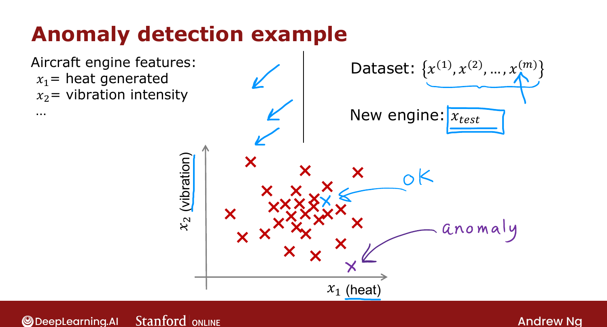
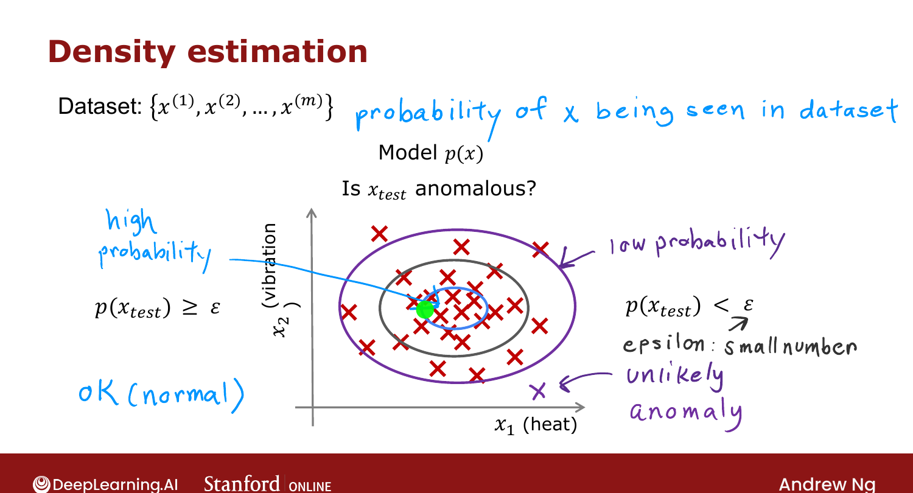

# Finding Unusual Events (Anomaly Detection)

> **Course 3 · Week 1** · _AI-generated study aid — not authoritative; trust the lecture & cited sources._

[← Choosing the Number of Clusters](../../course-3/week-1/choosing-the-number-of-clusters.md){ .md-button }

[Gaussian (Normal) Distribution →](../../course-3/week-1/gaussian-normal-distribution.md){ .md-button }

<video controls preload="none" playsinline src="https://dyckms5inbsqq.cloudfront.net/dlai/unsupervised-learning-recommenders-reinforcement-learning/W1/L8-MLS-C3W1L2S01_v4-L8/lc-unsupervised-learning-recommenders-reinforcement-learning-W1-L8-MLS-C3W1L2S01_v4-L8-master_360p.mp4?v=1752487435">Your browser can't play this video — <a href="https://dyckms5inbsqq.cloudfront.net/dlai/unsupervised-learning-recommenders-reinforcement-learning/W1/L8-MLS-C3W1L2S01_v4-L8/lc-unsupervised-learning-recommenders-reinforcement-learning-W1-L8-MLS-C3W1L2S01_v4-L8-master_360p.mp4?v=1752487435">download the lecture</a>.</video>

> 📄 **[Read the full lecture transcript](finding-unusual-events-transcript.md)**

The second unsupervised algorithm: **anomaly detection** learns from an unlabeled dataset of
**normal** events and raises a flag for **unusual** ones. `[00:01]`

## Aircraft-engine example

After an engine is manufactured, measure features like $x_1$ = heat generated and $x_2$ =
vibration intensity. Manufacturers make mostly **good** engines, so it's easy to collect
$m$ examples of **normal** behavior. When a new engine ($\vec{x}_\text{test}$) rolls off the
line, ask: does it look like the others (probably fine) or **very different** (inspect it
before shipping)? `[02:51]`

{ .slide }
_Official C3 slide — the aircraft-engine anomaly example (DeepLearning.AI / Stanford)._
{ .slide-cap }

## Density estimation

The standard approach is **density estimation**: from the training set, build a model of
$p(\vec{x})$ — which feature values are **high-probability** (likely) vs. **low-probability**
(rare). Then for a new $\vec{x}_\text{test}$: `[03:59]`

$$\text{if } p(\vec{x}_\text{test}) < \epsilon \;\Rightarrow\; \textbf{anomaly}; \qquad
\text{if } p(\vec{x}_\text{test}) \ge \epsilon \;\Rightarrow\; \text{OK}.$$

$\epsilon$ is a small threshold. A point near the high-probability center is fine; a point
way out in a low-probability region gets flagged. `[06:32]`

{ .slide }
_Official C3 slide — anomaly detection via density estimation (DeepLearning.AI / Stanford)._
{ .slide-cap }

## Where it's used

**Fraud detection** (model a user's typical activity — logins, transactions, typing speed —
and flag unusual patterns for extra checks, not auto-banning); **manufacturing** (engines,
circuit boards, phones); **monitoring computers** in data centers (memory, disk, CPU,
ratios). Anomaly detection is widely used commercially even if rarely talked about. `[07:09]`

To build it, we model $p(\vec{x})$ with a **Gaussian distribution** — next. `[11:26]`

[← Choosing the Number of Clusters](../../course-3/week-1/choosing-the-number-of-clusters.md){ .md-button }

[Gaussian (Normal) Distribution →](../../course-3/week-1/gaussian-normal-distribution.md){ .md-button }

