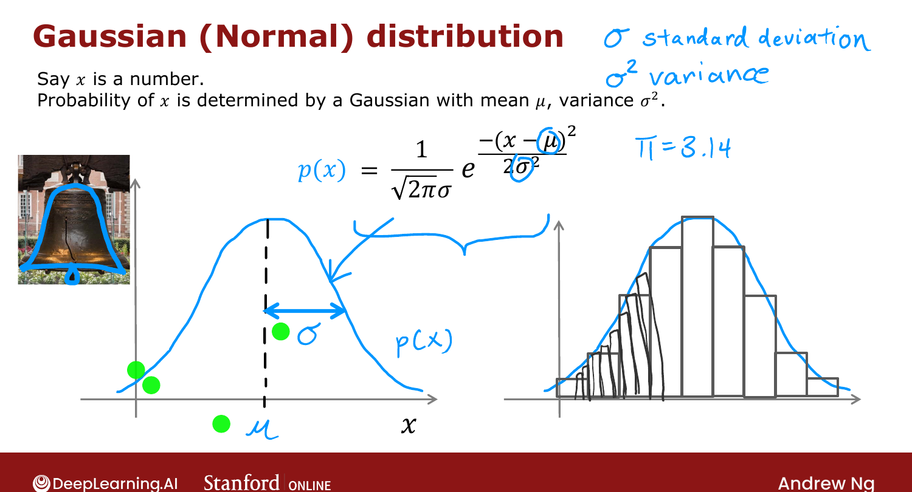
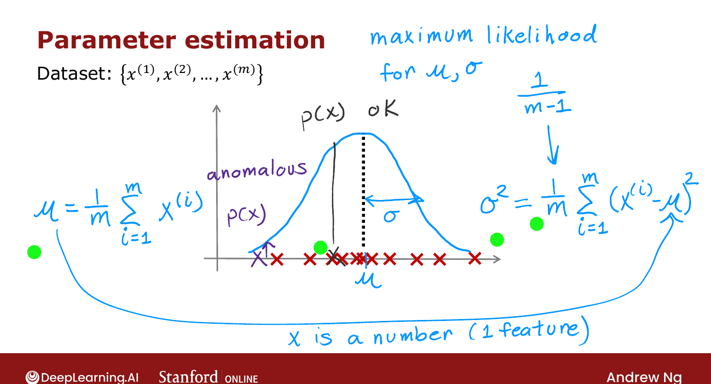

# Gaussian (Normal) Distribution

> **Course 3 · Week 1** · _AI-generated study aid — not authoritative; trust the lecture & cited sources._

[← Finding Unusual Events (Anomaly Detection)](../../course-3/week-1/finding-unusual-events.md){ .md-button }

[Anomaly Detection Algorithm →](../../course-3/week-1/anomaly-detection-algorithm.md){ .md-button }

<video controls preload="none" playsinline src="https://dyckms5inbsqq.cloudfront.net/dlai/unsupervised-learning-recommenders-reinforcement-learning/W1/L9-MLS-C3W1L2S02-Gaussian-normal-di/lc-unsupervised-learning-recommenders-reinforcement-learning-W1-L9-MLS-C3W1L2S02-Gaussian-normal-di-master_360p.mp4?v=1752487436">Your browser can't play this video — <a href="https://dyckms5inbsqq.cloudfront.net/dlai/unsupervised-learning-recommenders-reinforcement-learning/W1/L9-MLS-C3W1L2S02-Gaussian-normal-di/lc-unsupervised-learning-recommenders-reinforcement-learning-W1-L9-MLS-C3W1L2S02-Gaussian-normal-di-master_360p.mp4?v=1752487436">download the lecture</a>.</video>

> 📄 **[Read the full lecture transcript](gaussian-normal-distribution-transcript.md)**

To model $p(x)$ we use the **Gaussian** distribution — also called the **normal** or
**bell-shaped** distribution (all the same thing). `[00:02]`

## The bell curve

If a random variable $x$ follows a Gaussian with **mean** $\mu$ and **variance** $\sigma^2$
(where $\sigma$ is the **standard deviation**), then $p(x)$ is a bell-shaped curve centered
at $\mu$ whose width is set by $\sigma$: `[01:04]`

$$p(x) = \frac{1}{\sqrt{2\pi}\,\sigma}\, e^{-\frac{(x-\mu)^2}{2\sigma^2}}.$$

{ .slide }
_Official C3 slide — the Gaussian (normal) distribution (DeepLearning.AI / Stanford)._
{ .slide-cap }

_Drag $\mu$ and $\sigma$ to reshape the bell curve, and move a data point to see its probability drop as it lands in the tails — the basis of anomaly detection._
{ .mlw-caption }

How $\mu, \sigma$ change it: smaller $\sigma$ → **thinner and taller**; larger $\sigma$ →
**wider and shorter** (the area under the curve always equals 1); changing $\mu$ slides the
center left/right. `[06:17]`

## Estimating $\mu$ and $\sigma^2$ from data

Given $m$ examples (one feature), fit the Gaussian by: `[07:09]`

$$\mu = \frac{1}{m}\sum_{i=1}^{m} x^{(i)}, \qquad
\sigma^2 = \frac{1}{m}\sum_{i=1}^{m}\big(x^{(i)} - \mu\big)^2.$$

$\mu$ is the **average**; $\sigma^2$ is the **average squared deviation** from $\mu$. (These
are the **maximum-likelihood** estimates. Some texts divide $\sigma^2$ by $m-1$ instead of
$m$ — in practice it makes negligible difference; Ng uses $m$.) `[08:39]`

{ .slide }
_Official C3 slide — estimating μ and σ² (DeepLearning.AI / Stanford)._
{ .slide-cap }

With these, a point near the center has high $p(x)$ (normal); a point far out has low $p(x)$
(anomalous). So far this is one feature ($x$ a number); next we extend to **many** features. `[10:37]`

## Try it in the browser

**Try it — fit a Gaussian to each feature** — edit the code, then hit **Validate** for instant ✓/✗ (runs real Python via Pyodide, no setup):

{{ IDE('gaussian_exo') }}

[← Finding Unusual Events (Anomaly Detection)](../../course-3/week-1/finding-unusual-events.md){ .md-button }

[Anomaly Detection Algorithm →](../../course-3/week-1/anomaly-detection-algorithm.md){ .md-button }

