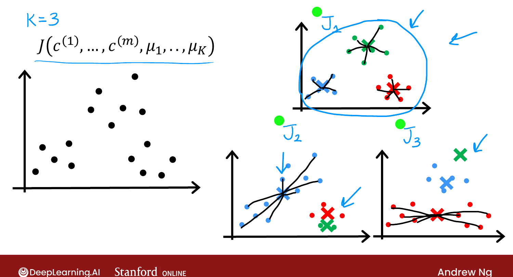
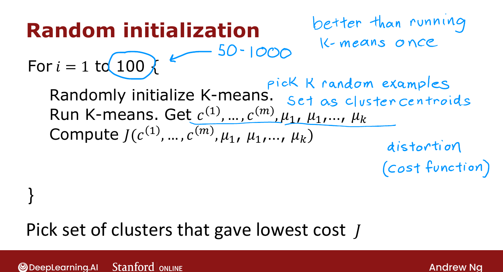

# Initializing K-means

> **Course 3 · Week 1** · _AI-generated study aid — not authoritative; trust the lecture & cited sources._

<div class="ep-nav" markdown>

[← Optimization Objective](../../course-3/week-1/optimization-objective.md){ .md-button }

[Choosing the Number of Clusters →](../../course-3/week-1/choosing-the-number-of-clusters.md){ .md-button }

</div>

<div class="video-wrap"><video controls preload="none" playsinline src="https://dyckms5inbsqq.cloudfront.net/dlai/unsupervised-learning-recommenders-reinforcement-learning/W1/L6-MLS-C3W1L1S06-Initializing-K-mea/lc-unsupervised-learning-recommenders-reinforcement-learning-W1-L6-MLS-C3W1L1S06-Initializing-K-mea-master_360p.mp4?v=1752487435">Your browser can't play this video — <a href="https://dyckms5inbsqq.cloudfront.net/dlai/unsupervised-learning-recommenders-reinforcement-learning/W1/L6-MLS-C3W1L1S06-Initializing-K-mea/lc-unsupervised-learning-recommenders-reinforcement-learning-W1-L6-MLS-C3W1L1S06-Initializing-K-mea-master_360p.mp4?v=1752487435">download the lecture</a>.</video></div>

> 📄 **[Read the full lecture transcript](initializing-k-means-transcript.md)**

How to take the random initial guess for the centroids — and how multiple attempts find a
better clustering. `[00:01]`

## Random initialization

Always choose $K < m$ (you need at least one example per cluster). The most common method:
**randomly pick $K$ training examples** and set $\mu_1,\dots,\mu_K$ to those points. (The
earlier illustrations used random *points*, but initializing **on top of training examples**
is the standard way.) `[00:38]`

## Local optima

Different random initializations can lead K-means to **different** clusterings. With $K=3$,
a lucky init gives a clean 3-cluster split; an unlucky one (e.g. two centroids landing in
one group) gets **stuck in a local minimum** of the distortion $J$ — a worse clustering. `[03:42]`

{ .slide }
_Official C3 slide — K-means can get stuck in local optima (DeepLearning.AI / Stanford)._
{ .slide-cap }

## Run it multiple times, keep the lowest cost

To beat local optima, **run K-means many times** with different random inits, compute the
distortion $J$ for each result, and **keep the one with the lowest $J$**: `[04:42]`

```text
for i = 1 to 100 {
    randomly initialize K-means (pick K training examples)
    run K-means to convergence → get c, μ
    compute distortion J(c, μ)
}
pick the clustering with the lowest J
```

50–1,000 runs is common; beyond ~1,000 it's computationally expensive with diminishing
returns. Ng almost always uses multiple initializations — it reliably gives a better
clustering. `[07:58]`

{ .slide }
_Official C3 slide — multiple random initializations (DeepLearning.AI / Stanford)._
{ .slide-cap }

Next: choosing $K$, the number of clusters. `[08:37]`


<div class="ep-nav" markdown>

[← Optimization Objective](../../course-3/week-1/optimization-objective.md){ .md-button }

[Choosing the Number of Clusters →](../../course-3/week-1/choosing-the-number-of-clusters.md){ .md-button }

</div>
