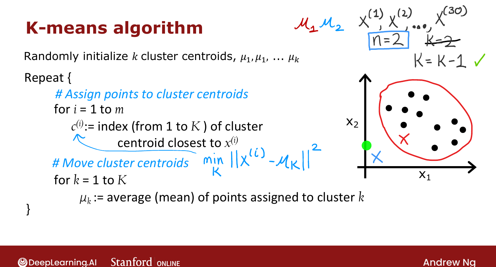
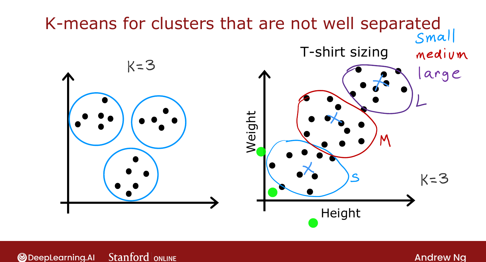

# K-means Algorithm

> **Course 3 · Week 1** · _AI-generated study aid — not authoritative; trust the lecture & cited sources._

<div class="ep-nav" markdown>

[← K-means Intuition](../../course-3/week-1/k-means-intuition.md){ .md-button }

[Optimization Objective →](../../course-3/week-1/optimization-objective.md){ .md-button }

</div>

<div class="video-wrap"><video controls preload="none" playsinline src="https://dyckms5inbsqq.cloudfront.net/dlai/unsupervised-learning-recommenders-reinforcement-learning/W1/L4-MLS-C3W1L1S04-K-means-algorithm-/lc-unsupervised-learning-recommenders-reinforcement-learning-W1-L4-MLS-C3W1L1S04-K-means-algorithm--master_360p.mp4?v=1752487435">Your browser can't play this video — <a href="https://dyckms5inbsqq.cloudfront.net/dlai/unsupervised-learning-recommenders-reinforcement-learning/W1/L4-MLS-C3W1L1S04-K-means-algorithm-/lc-unsupervised-learning-recommenders-reinforcement-learning-W1-L4-MLS-C3W1L1S04-K-means-algorithm--master_360p.mp4?v=1752487435">download the lecture</a>.</video></div>

> 📄 **[Read the full lecture transcript](k-means-algorithm-transcript.md)**

The two intuitive steps, written out precisely. `[00:02]`

## The algorithm

```text
Randomly initialize K cluster centroids μ₁, μ₂, …, μ_K
Repeat {
    # Step 1 — assign points to centroids
    for i = 1 to m:
        c⁽ⁱ⁾ := index k (1..K) of the centroid closest to x⁽ⁱ⁾
                = argmin_k ‖x⁽ⁱ⁾ − μ_k‖²
    # Step 2 — move centroids
    for k = 1 to K:
        μ_k := mean of the points assigned to cluster k
}
```

- The centroids $\mu_k$ are **vectors with the same dimension** $n$ as the training examples. `[01:05]`
- **Step 1** sets $c^{(i)}$ to the cluster whose centroid minimizes the **squared distance**
  $\|x^{(i)} - \mu_k\|^2$ (the L2 norm; squaring is more convenient and gives the same
  nearest centroid). `[02:38]`
- **Step 2** sets each $\mu_k$ to the **average** of the points assigned to it. If cluster 1
  holds examples 1, 5, 6, 10, then $\mu_1 = \frac{1}{4}(x^{(1)}+x^{(5)}+x^{(6)}+x^{(10)})$. `[05:33]`

{ .slide }
_Official C3 slide — the K-means algorithm (DeepLearning.AI / Stanford)._
{ .slide-cap }

## Corner case: an empty cluster

If a cluster gets **zero** points assigned, the mean is undefined. Most common fix:
**eliminate** that cluster (ending with $K-1$). Alternatively, **randomly reinitialize** it
and hope it picks up points next round. `[06:38]`

## Clusters that aren't well separated

K-means is also used when clusters **aren't** clearly separated. For **t-shirt sizing**,
people's height/weight vary continuously with no clear groups — yet running K-means with 3
centroids carves out sensible **small / medium / large** groups to design each size around. `[07:36]`

{ .slide }
_Official C3 slide — K-means on not-well-separated data (DeepLearning.AI / Stanford)._
{ .slide-cap }

Next: the **cost function** K-means is secretly optimizing. `[--]`

## Try it in the browser

**Try it — implement the K-means assignment step** — edit the code, then hit **Validate** for instant ✓/✗ (runs real Python via Pyodide, no setup):

{{ IDE('closest_centroid_exo') }}


<div class="ep-nav" markdown>

[← K-means Intuition](../../course-3/week-1/k-means-intuition.md){ .md-button }

[Optimization Objective →](../../course-3/week-1/optimization-objective.md){ .md-button }

</div>
