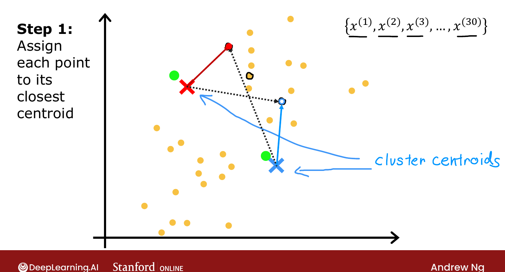
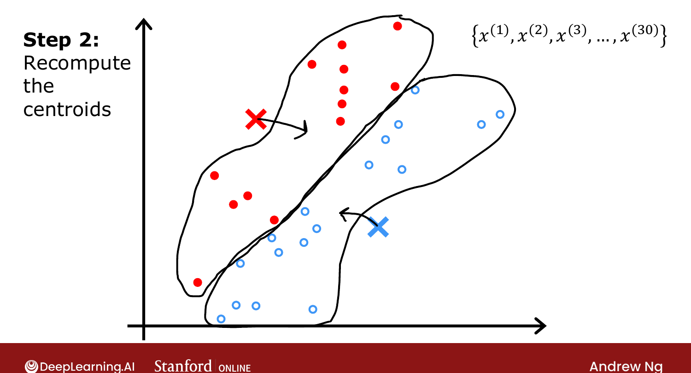

# K-means Intuition

> **Course 3 · Week 1** · _AI-generated study aid — not authoritative; trust the lecture & cited sources._

[← What is Clustering?](../../course-3/week-1/what-is-clustering.md){ .md-button }

[K-means Algorithm →](../../course-3/week-1/k-means-algorithm.md){ .md-button }

<video controls preload="none" playsinline src="https://dyckms5inbsqq.cloudfront.net/dlai/unsupervised-learning-recommenders-reinforcement-learning/W1/L3-MLS-C3W1L1S03-K-means-intuition-/lc-unsupervised-learning-recommenders-reinforcement-learning-W1-L3-MLS-C3W1L1S03-K-means-intuition--master_360p.mp4?v=1752487434">Your browser can't play this video — <a href="https://dyckms5inbsqq.cloudfront.net/dlai/unsupervised-learning-recommenders-reinforcement-learning/W1/L3-MLS-C3W1L1S03-K-means-intuition-/lc-unsupervised-learning-recommenders-reinforcement-learning-W1-L3-MLS-C3W1L1S03-K-means-intuition--master_360p.mp4?v=1752487434">download the lecture</a>.</video>

> 📄 **[Read the full lecture transcript](k-means-intuition-transcript.md)**

K-means repeatedly does **two things**: assign points to cluster centroids, and move the
centroids. `[01:05]`

## The two steps

Start with 30 unlabeled points and ask for 2 clusters. K-means first **randomly guesses** two
**cluster centroids** (a red cross and a blue cross) — a rough start. Then it loops: `[00:31]`

1. **Assign points to centroids.** For each of the 30 points, check whether it's closer to
   the red or the blue centroid, and color it accordingly. `[01:17]`

{ .slide }
_Official C3 slide — assign points to the nearest centroid (DeepLearning.AI / Stanford)._
{ .slide-cap }

2. **Move centroids.** Move the red cross to the **average** location of all the red points,
   and the blue cross to the average of the blue points. `[02:58]`

{ .slide }
_Official C3 slide — recompute the centroids (DeepLearning.AI / Stanford)._
{ .slide-cap }

## Convergence

Repeat the two steps. Each round, some points change color as the centroids move; eventually
**no points change color and the centroids stop moving** — K-means has **converged**, having
found the two clusters. `[05:48]`

So the two key steps are: **assign** each point to its nearest centroid, then **move** each
centroid to the mean of its points. Next: write this out as a precise algorithm. `[06:39]`

[← What is Clustering?](../../course-3/week-1/what-is-clustering.md){ .md-button }

[K-means Algorithm →](../../course-3/week-1/k-means-algorithm.md){ .md-button }

