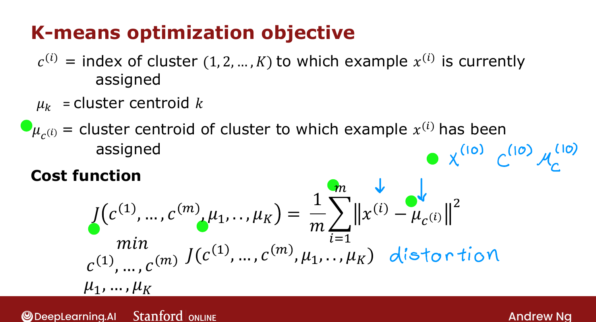

# Optimization Objective

> **Course 3 · Week 1** · _AI-generated study aid — not authoritative; trust the lecture & cited sources._

[← K-means Algorithm](../../course-3/week-1/k-means-algorithm.md){ .md-button }

[Initializing K-means →](../../course-3/week-1/initializing-k-means.md){ .md-button }

<video controls preload="none" playsinline src="https://dyckms5inbsqq.cloudfront.net/dlai/unsupervised-learning-recommenders-reinforcement-learning/W1/L5-MLS-C3W1L1S05-Optimization-objec/lc-unsupervised-learning-recommenders-reinforcement-learning-W1-L5-MLS-C3W1L1S05-Optimization-objec-master_360p.mp4?v=1752487435">Your browser can't play this video — <a href="https://dyckms5inbsqq.cloudfront.net/dlai/unsupervised-learning-recommenders-reinforcement-learning/W1/L5-MLS-C3W1L1S05-Optimization-objec/lc-unsupervised-learning-recommenders-reinforcement-learning-W1-L5-MLS-C3W1L1S05-Optimization-objec-master_360p.mp4?v=1752487435">download the lecture</a>.</video>

> 📄 **[Read the full lecture transcript](optimization-objective-transcript.md)**

Like supervised learning, K-means is **optimizing a cost function** — it just uses its own
algorithm (the two steps) instead of gradient descent. `[00:18]`

## The cost function (distortion)

Notation: $c^{(i)}$ = index of the cluster example $x^{(i)}$ is assigned to; $\mu_k$ =
location of centroid $k$; and $\mu_{c^{(i)}}$ = the centroid of the cluster $x^{(i)}$ belongs
to. The cost is the **average squared distance** from each point to its assigned centroid: `[02:01]`

$$J(c^{(1)},\dots,c^{(m)}, \mu_1,\dots,\mu_K) = \frac{1}{m}\sum_{i=1}^{m}\big\|x^{(i)} - \mu_{c^{(i)}}\big\|^2.$$

This is also called the **distortion function**. K-means tries to find the assignments
*and* centroid locations that **minimize** it. `[04:50]`

{ .slide }
_Official C3 slide — the K-means optimization objective (DeepLearning.AI / Stanford)._
{ .slide-cap }

## Why the two steps minimize $J$

- **Step 1 (assign points)** updates $c^{(1)},\dots,c^{(m)}$ to minimize $J$ while holding the
  centroids $\mu$ fixed — and the way to minimize each point's squared distance is to assign
  it to the **closest** centroid. `[05:21]`
- **Step 2 (move centroids)** holds the assignments fixed and updates $\mu_1,\dots,\mu_K$ to
  minimize $J$ — and the point minimizing the average squared distance to a set of points is
  their **mean**. `[05:45]`

So each step provably reduces (never increases) the distortion, which is why K-means
converges. A useful consequence: $J$ should **go down every iteration** — if it ever goes up,
there's a bug. Next: how to **initialize** the centroids. `[--]`

[← K-means Algorithm](../../course-3/week-1/k-means-algorithm.md){ .md-button }

[Initializing K-means →](../../course-3/week-1/initializing-k-means.md){ .md-button }

