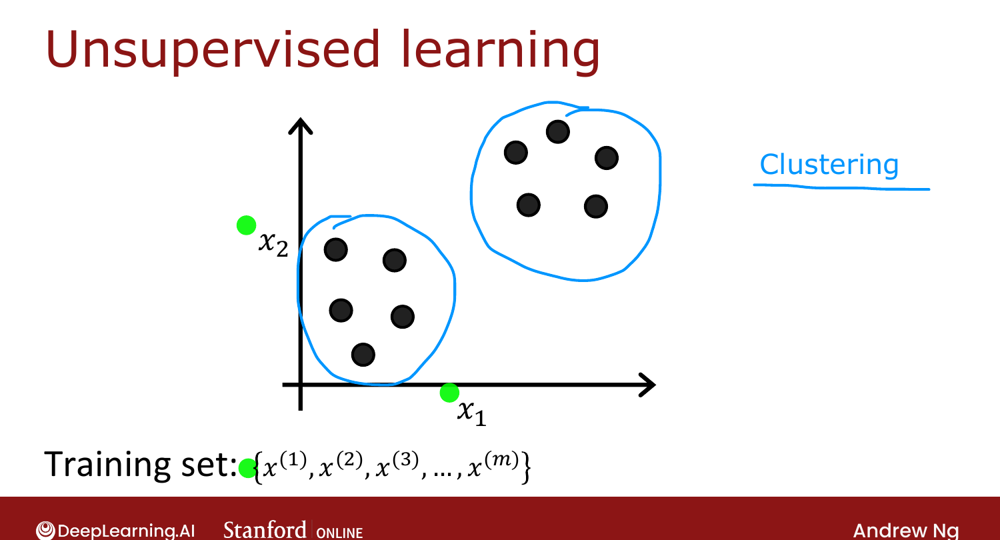
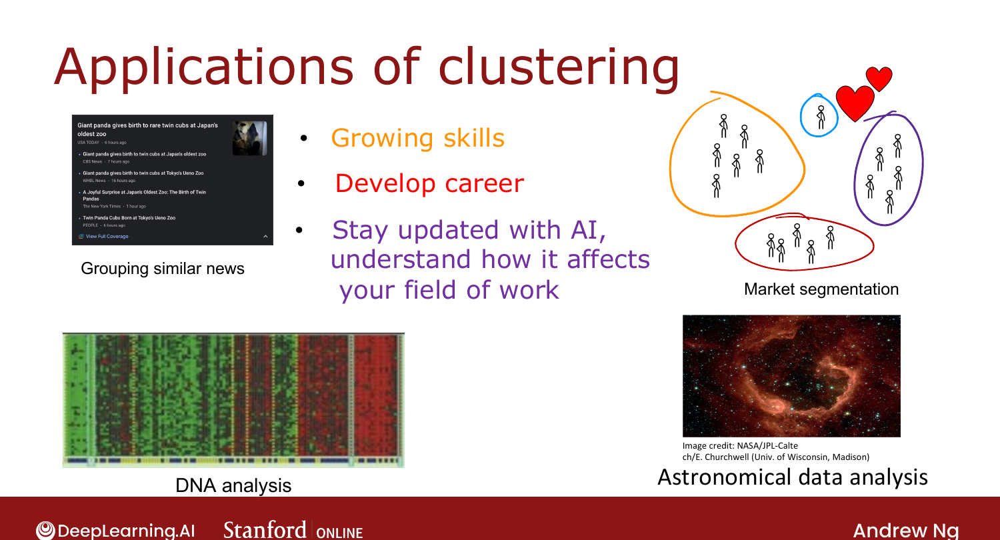

# What is Clustering?

> **Course 3 · Week 1** · _AI-generated study aid — not authoritative; trust the lecture & cited sources._

[← When to Use Decision Trees](../../course-2/week-4/when-to-use-decision-trees.md){ .md-button }

[K-means Intuition →](../../course-3/week-1/k-means-intuition.md){ .md-button }

<video controls preload="none" playsinline src="https://dyckms5inbsqq.cloudfront.net/dlai/unsupervised-learning-recommenders-reinforcement-learning/W1/L2-MLS-C3W1L1S02-What-is-clustering/lc-unsupervised-learning-recommenders-reinforcement-learning-W1-L2-MLS-C3W1L1S02-What-is-clustering-master_360p.mp4?v=1752487434">Your browser can't play this video — <a href="https://dyckms5inbsqq.cloudfront.net/dlai/unsupervised-learning-recommenders-reinforcement-learning/W1/L2-MLS-C3W1L1S02-What-is-clustering/lc-unsupervised-learning-recommenders-reinforcement-learning-W1-L2-MLS-C3W1L1S02-What-is-clustering-master_360p.mp4?v=1752487434">download the lecture</a>.</video>

> 📄 **[Read the full lecture transcript](what-is-clustering-transcript.md)**

Welcome to Course 3. A **clustering** algorithm looks at data points and automatically finds
groups of points that are **similar** to each other — an **unsupervised** learning method. `[00:03]`

## Supervised vs. unsupervised

- **Supervised** learning: the dataset has both inputs $\vec{x}$ **and** labels $y$ (the x's
  and o's), so you can fit a decision boundary. `[00:26]`
- **Unsupervised** learning: the dataset has **only** $\vec{x}$, no labels — so you plot
  plain dots. With no target $y$, you can't tell the algorithm the "right answer"; instead
  you ask it to find **interesting structure** in the data. `[00:58]`

**Clustering** looks for one kind of structure: grouping points into **clusters** of similar
points. `[01:50]`

{ .slide }
_Official C3 slide — supervised (labeled) vs. unsupervised (unlabeled) (DeepLearning.AI / Stanford)._
{ .slide-cap }

## Applications

- Grouping similar **news articles** (e.g. all the panda stories). `[02:12]`
- **Market segmentation** (e.g. DeepLearning.AI learners grouped by goal: grow skills /
  develop careers / stay updated on AI). `[02:24]`
- **DNA analysis** — grouping individuals by genetic expression. `[02:59]`
- **Astronomy** — grouping bodies in space to find galaxies / coherent structures. `[03:15]`

{ .slide }
_Official C3 slide — clustering applications (DeepLearning.AI / Stanford)._
{ .slide-cap }

Next: the most common clustering algorithm — **K-means**. `[04:02]`

[← When to Use Decision Trees](../../course-2/week-4/when-to-use-decision-trees.md){ .md-button }

[K-means Intuition →](../../course-3/week-1/k-means-intuition.md){ .md-button }

