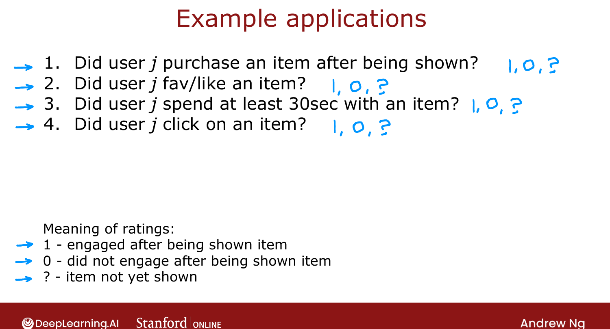
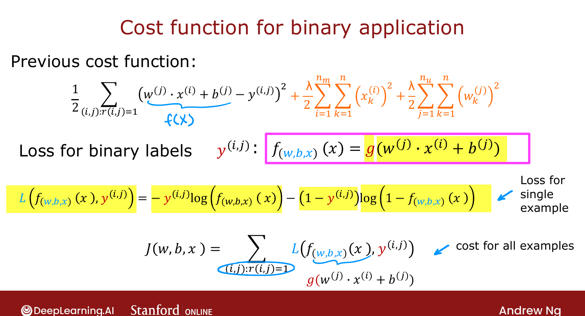

# Binary Labels: Favs, Likes and Clicks

> **Course 3 · Week 2** · _AI-generated study aid — not authoritative; trust the lecture & cited sources._

[← Collaborative Filtering Algorithm](../../course-3/week-2/collaborative-filtering-algorithm.md){ .md-button }

[Mean Normalization →](../../course-3/week-2/mean-normalization.md){ .md-button }

<video controls preload="none" playsinline src="https://dyckms5inbsqq.cloudfront.net/dlai/unsupervised-learning-recommenders-reinforcement-learning/W2/L4-MLS-C3W2L1S04-binary-labels_-fav/lc-unsupervised-learning-recommenders-reinforcement-learning-W2-L4-MLS-C3W2L1S04-binary-labels_-fav-master_360p.mp4?v=1752487437">Your browser can't play this video — <a href="https://dyckms5inbsqq.cloudfront.net/dlai/unsupervised-learning-recommenders-reinforcement-learning/W2/L4-MLS-C3W2L1S04-binary-labels_-fav/lc-unsupervised-learning-recommenders-reinforcement-learning-W2-L4-MLS-C3W2L1S04-binary-labels_-fav-master_360p.mp4?v=1752487437">download the lecture</a>.</video>

> 📄 **[Read the full lecture transcript](binary-labels-favs-likes-and-clicks-transcript.md)**

Many important recommender applications give you **binary** labels (the user did or
didn't engage) rather than 0–5 star ratings. Collaborative filtering **generalizes** to
this the same way linear regression generalized to logistic regression. `[00:02]`

## Where binary labels come from

The label $y(i,j)$ means something like: did user $j$ **favorite / like / click / buy /
spend ≥30s on** item $i$? So $1$ = engaged, $0$ = shown but didn't engage, $?$ = not yet
shown. Online advertising is a huge case — predicting whether a user clicks an ad. `[02:34]`

{ .slide }
_Official C3 slide — applications with binary labels (DeepLearning.AI / Stanford)._
{ .slide-cap }

## From regression to binary

For star ratings we predicted $y(i,j) = \vec{w}^{(j)}\cdot\vec{x}^{(i)} + b^{(j)}$. For
binary labels we instead predict the **probability** that $y(i,j)=1$, by passing that same
quantity through the logistic function $g(z) = \frac{1}{1+e^{-z}}$: `[03:33]`

$$P\big(y(i,j)=1\big) = g\!\left(\vec{w}^{(j)}\cdot\vec{x}^{(i)} + b^{(j)}\right).$$

This is exactly the linear→logistic regression move from Course 1, applied per (user, item).

## The binary cost function

For star ratings the loss was squared error. For binary labels, swap in the **binary
cross-entropy** loss (again, straight from logistic regression) — with
$f = g(\vec{w}^{(j)}\cdot\vec{x}^{(i)} + b^{(j)})$: `[04:36]`

$$L\big(f, y(i,j)\big) = -y(i,j)\log(f) - \big(1 - y(i,j)\big)\log(1 - f),$$

and the overall cost sums this loss over every $(i,j)$ with $r(i,j)=1$. Everything else —
learning $\vec{w}, b, \vec{x}$ together by gradient descent — carries over unchanged. `[05:00]`

{ .slide }
_Official C3 slide — the binary collaborative-filtering cost (DeepLearning.AI / Stanford)._
{ .slide-cap }

!!! abstract "Source: Prince, *Understanding Deep Learning* §5.4"
    Prince derives the **binary cross-entropy** loss as the negative log-likelihood of a
    Bernoulli model whose parameter is $\text{sigmoid}(z)$ — the same principle Ng applies
    here: model $P(y{=}1)$ with a sigmoid, then maximize the data's likelihood.

Next: a refinement — **mean normalization** — that makes the algorithm behave far better
for users (and items) with very few ratings. `[05:34]`

[← Collaborative Filtering Algorithm](../../course-3/week-2/collaborative-filtering-algorithm.md){ .md-button }

[Mean Normalization →](../../course-3/week-2/mean-normalization.md){ .md-button }

