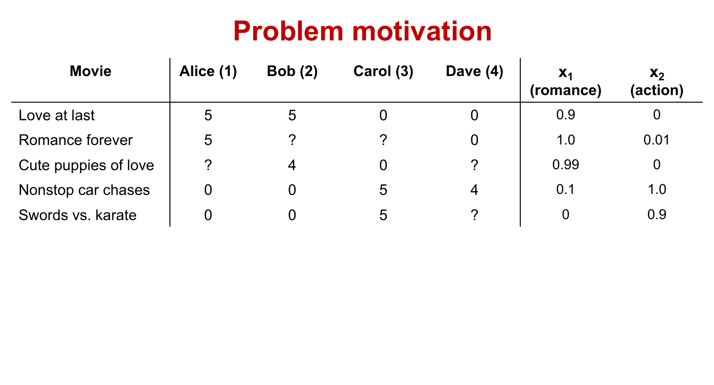
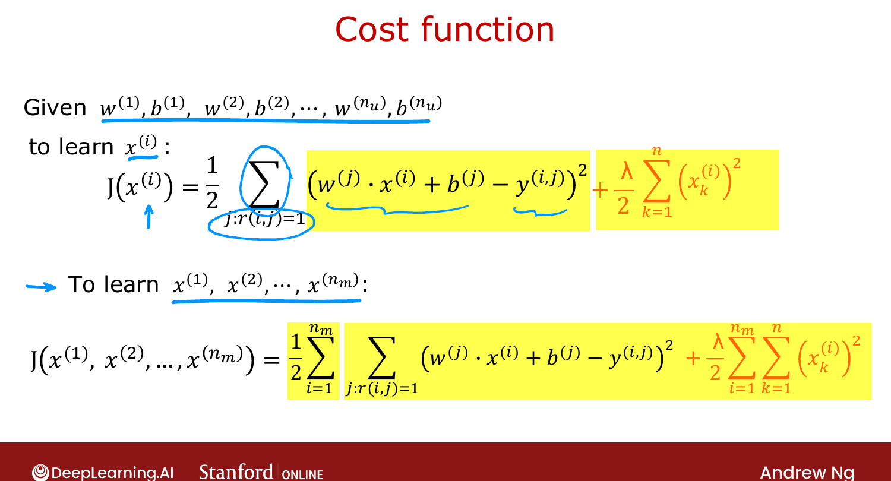

# Collaborative Filtering Algorithm

> **Course 3 · Week 2** · _AI-generated study aid — not authoritative; trust the lecture & cited sources._

[← Using Per-Item Features](../../course-3/week-2/using-per-item-features.md){ .md-button }

[Binary Labels: Favs, Likes and Clicks →](../../course-3/week-2/binary-labels-favs-likes-and-clicks.md){ .md-button }

<video controls preload="none" playsinline src="https://dyckms5inbsqq.cloudfront.net/dlai/unsupervised-learning-recommenders-reinforcement-learning/W2/L3-MLS-C3W2L1S03-collaborative-filt/lc-unsupervised-learning-recommenders-reinforcement-learning-W2-L3-MLS-C3W2L1S03-collaborative-filt-master_360p.mp4?v=1752487437">Your browser can't play this video — <a href="https://dyckms5inbsqq.cloudfront.net/dlai/unsupervised-learning-recommenders-reinforcement-learning/W2/L3-MLS-C3W2L1S03-collaborative-filt/lc-unsupervised-learning-recommenders-reinforcement-learning-W2-L3-MLS-C3W2L1S03-collaborative-filt-master_360p.mp4?v=1752487437">download the lecture</a>.</video>

> 📄 **[Read the full lecture transcript](collaborative-filtering-algorithm-transcript.md)**

What if you **don't** have the movie features $x_1, x_2$? Collaborative filtering **learns
them** from the ratings. `[00:02]`

## Learning features from parameters

Suppose you'd somehow already learned each user's parameters $\vec{w}^{(j)}$ (e.g.
$\vec{w}^{(1)}=[5,0]$, $\vec{w}^{(3)}=[0,5]$, …). Then for movie 1, you know what its
features $\vec{x}^{(1)}$ *should* be: they must make $\vec{w}^{(j)}\cdot\vec{x}^{(1)}$ match
each user's actual rating. With Alice and Bob rating it ~5 and Carol/Dave ~0, $\vec{x}^{(1)} =
[1,0]$ fits. So **given the parameters, you can guess the features**. `[03:30]`

{ .slide }
_Official C3 slide — inferring item features from user parameters (DeepLearning.AI / Stanford)._
{ .slide-cap }

## Cost to learn features

To learn the features $\vec{x}^{(i)}$, minimize the squared error over the users who rated
that movie, plus regularization — the **mirror image** of the previous cost: `[04:04]`

$$J(\vec{x}^{(i)}) = \frac{1}{2}\!\!\sum_{j:\,r(i,j)=1}\!\!\big(\vec{w}^{(j)}\!\cdot\vec{x}^{(i)} + b^{(j)} - y(i,j)\big)^2 + \frac{\lambda}{2}\sum_{k=1}^{n}\big(x^{(i)}_k\big)^2.$$

## The collaborative-filtering trick

The key insight: you can learn $\vec{w}, b$ **from** features, *and* features **from**
$\vec{w}, b$. So put them in **one cost function** and minimize over **both** at once: `[--]`

$$\min_{\vec{w},b,\vec{x}} \; \frac{1}{2}\!\!\sum_{(i,j):\,r(i,j)=1}\!\!\big(\vec{w}^{(j)}\!\cdot\vec{x}^{(i)} + b^{(j)} - y(i,j)\big)^2 + \text{(regularization on } \vec{w} \text{ and } \vec{x}).$$

Gradient descent now updates $\vec{w}$, $b$, **and** $\vec{x}$. It's called **collaborative**
filtering because the ratings of **many users collaborate** to learn the features of each
movie — which in turn improve everyone's predictions. `[--]`

{ .slide }
_Official C3 slide — the collaborative-filtering cost function (DeepLearning.AI / Stanford)._
{ .slide-cap }

Next: handling **binary** labels (likes/clicks) instead of star ratings. `[--]`

[← Using Per-Item Features](../../course-3/week-2/using-per-item-features.md){ .md-button }

[Binary Labels: Favs, Likes and Clicks →](../../course-3/week-2/binary-labels-favs-likes-and-clicks.md){ .md-button }

