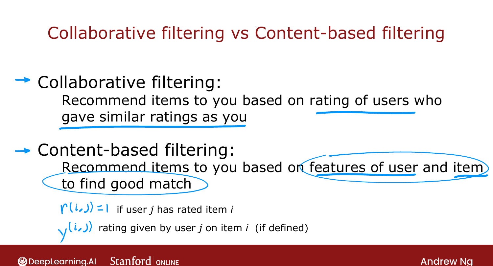
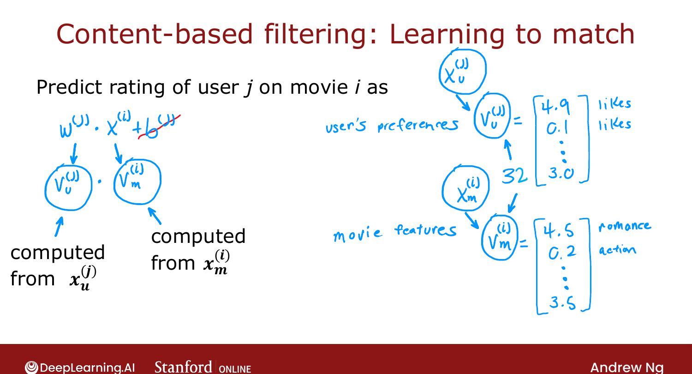

# Collaborative Filtering vs. Content-Based Filtering

> **Course 3 · Week 2** · _AI-generated study aid — not authoritative; trust the lecture & cited sources._

[← Finding Related Items](../../course-3/week-2/finding-related-items.md){ .md-button }

[Deep Learning for Content-Based Filtering →](../../course-3/week-2/deep-learning-for-content-based-filtering.md){ .md-button }

<video controls preload="none" playsinline src="https://dyckms5inbsqq.cloudfront.net/dlai/unsupervised-learning-recommenders-reinforcement-learning/W2/L8-MLS-C3W2L3S01-Collaborative-filt/lc-unsupervised-learning-recommenders-reinforcement-learning-W2-L8-MLS-C3W2L3S01-Collaborative-filt-master_360p.mp4?v=1752487438">Your browser can't play this video — <a href="https://dyckms5inbsqq.cloudfront.net/dlai/unsupervised-learning-recommenders-reinforcement-learning/W2/L8-MLS-C3W2L3S01-Collaborative-filt/lc-unsupervised-learning-recommenders-reinforcement-learning-W2-L8-MLS-C3W2L3S01-Collaborative-filt-master_360p.mp4?v=1752487438">download the lecture</a>.</video>

> 📄 **[Read the full lecture transcript](collaborative-filtering-vs-content-based-filtering-transcript.md)**

A second family of recommenders — **content-based filtering** — addresses collaborative
filtering's blind spot: it explicitly uses **features of users and items** to find good
matches. `[00:02]`

## The contrast

- **Collaborative filtering** recommends items based on **ratings of users similar to you**.
  All it needs is the ratings matrix; it *learns* item features from scratch.
- **Content-based filtering** recommends based on **features of the user and features of the
  item**, matching them up. You still use $r(i,j)$ and $y(i,j)$ for who-rated-what, but now
  you bring known features to the table. `[00:19]`

{ .slide }
_Official C3 slide — the two recommender philosophies (DeepLearning.AI / Stanford)._
{ .slide-cap }

## User and item features

- **User features $\vec{x}_u^{(j)}$:** age; gender (one-hot, 3-way); country (one-hot, ~200);
  which of the top-1000 movies they've watched; average rating they give *per genre*. Note
  the last one is built **from the user's own ratings** — that's perfectly fine. `[02:02]`
- **Item features $\vec{x}_m^{(i)}$:** year; genre(s); critic reviews; the movie's average
  rating (again, derived from ratings — fine). `[04:04]`

Crucially, the user and item feature vectors **can be different sizes** (e.g. 1500 user
numbers, 50 movie numbers). `[05:27]`

## Learning to match

Drop the $b^{(j)}$ term. Instead of $\vec{w}^{(j)}\cdot\vec{x}^{(i)}$, compute two new
vectors from the features and predict via their dot product: `[05:44]`

$$\text{prediction} = \vec{v}_u^{(j)} \cdot \vec{v}_m^{(i)},$$

where $\vec{v}_u^{(j)}$ is computed from the **user** features and $\vec{v}_m^{(i)}$ from the
**movie** features. If $\vec{v}_u = [4.9, 0.1, \dots]$ captures "loves romance, not action"
and $\vec{v}_m = [4.5, 0.2, \dots]$ captures "is romance, not action," their dot product
predicts a high rating. The two raw feature vectors can differ in size, but $\vec{v}_u$ and
$\vec{v}_m$ **must be the same dimension** (e.g. both 32) to take a dot product. `[08:43]`

{ .slide }
_Official C3 slide — content-based filtering learns to match (DeepLearning.AI / Stanford)._
{ .slide-cap }

So the question becomes: **how do we compute $\vec{v}_u$ and $\vec{v}_m$ from the features?**
Next: deep learning. `[09:40]`

[← Finding Related Items](../../course-3/week-2/finding-related-items.md){ .md-button }

[Deep Learning for Content-Based Filtering →](../../course-3/week-2/deep-learning-for-content-based-filtering.md){ .md-button }

