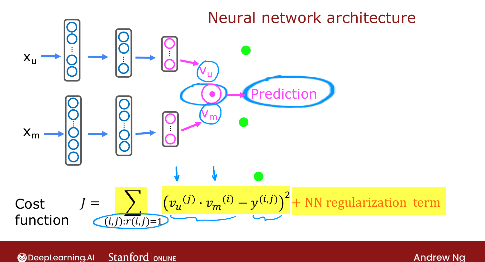
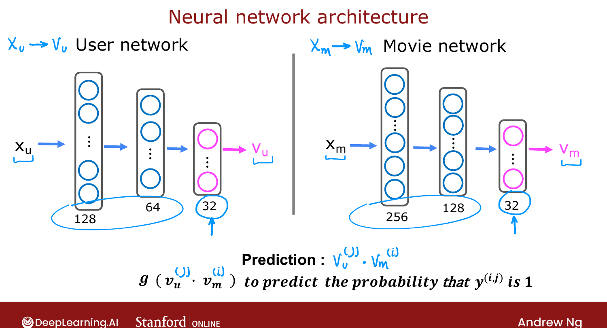

# Deep Learning for Content-Based Filtering

> **Course 3 · Week 2** · _AI-generated study aid — not authoritative; trust the lecture & cited sources._

[← Collaborative Filtering vs. Content-Based Filtering](../../course-3/week-2/collaborative-filtering-vs-content-based-filtering.md){ .md-button }

[Recommending from a Large Catalogue →](../../course-3/week-2/recommending-from-a-large-catalogue.md){ .md-button }

<video controls preload="none" playsinline src="https://dyckms5inbsqq.cloudfront.net/dlai/unsupervised-learning-recommenders-reinforcement-learning/W2/L9-MLS-C3W2L3S02-Deep-learning-for-/lc-unsupervised-learning-recommenders-reinforcement-learning-W2-L9-MLS-C3W2L3S02-Deep-learning-for--master_360p.mp4?v=1752487438">Your browser can't play this video — <a href="https://dyckms5inbsqq.cloudfront.net/dlai/unsupervised-learning-recommenders-reinforcement-learning/W2/L9-MLS-C3W2L3S02-Deep-learning-for-/lc-unsupervised-learning-recommenders-reinforcement-learning-W2-L9-MLS-C3W2L3S02-Deep-learning-for--master_360p.mp4?v=1752487438">download the lecture</a>.</video>

> 📄 **[Read the full lecture transcript](deep-learning-for-content-based-filtering-transcript.md)**

The way most state-of-the-art content-based recommenders are built today: compute
$\vec{v}_u$ and $\vec{v}_m$ with **neural networks** — a **user network** and a **movie
network** — then dot-product their outputs. `[00:01]`

## Two networks, one prediction

- The **user network** takes the raw user features $\vec{x}_u$ (age, gender, country, …)
  through dense layers and outputs $\vec{v}_u$ — here a **32-number** vector (note: the
  output layer has 32 units, not 1). `[00:56]`
- The **movie network** takes $\vec{x}_m$ (year, stars, …) and outputs $\vec{v}_m$, also 32
  numbers. The two networks **may have different depths and widths** — only their **output
  layers must match in size** so the dot product works. `[01:39]`

Prediction = $\vec{v}_u^{(j)} \cdot \vec{v}_m^{(i)}$. For **binary** labels, wrap it in a
sigmoid: $P(y^{(i,j)}=1) = g\!\big(\vec{v}_u^{(j)} \cdot \vec{v}_m^{(i)}\big)$. `[02:25]`

{ .slide }
_Official C3 slide — the combined user/movie network architecture (DeepLearning.AI / Stanford)._
{ .slide-cap }

{ .slide }
_Official C3 slide — the user and movie networks (DeepLearning.AI / Stanford)._
{ .slide-cap }
## Training: one cost, both networks together

There's **no separate training** for the two networks. You draw them as one combined model
and train **all** parameters jointly to minimize the familiar squared-error cost (plus the
usual NN regularization): `[03:56]`

$$J = \sum_{(i,j):\,r(i,j)=1}\big(\vec{v}_u^{(j)} \cdot \vec{v}_m^{(i)} - y^{(i,j)}\big)^2 + \text{(NN regularization)}.$$

Gradient descent tunes both networks so the resulting $\vec{v}_u, \vec{v}_m$ predict ratings
well. `[05:13]`

!!! abstract "Source: Prince, *Understanding Deep Learning* (Ch. 18, two-tower / matching)"
    This **two-tower** design — separate encoders for each entity, joined only by an
    inner product at the top — is the canonical retrieval architecture Prince discusses for
    matching problems. The shared output dimension is exactly what lets the two towers live
    in a common embedding space.

## Finding similar items, again

The learned $\vec{v}_m^{(i)}$ lets you find related movies the same way as before: the items
$k$ minimizing $\lVert \vec{v}_m^{(k)} - \vec{v}_m^{(i)} \rVert^2$. Better yet, this can be
**pre-computed overnight** — so when a user browses a movie, the 10–20 most similar are
already ready. (That pre-computation matters for the next topic: large catalogues.) `[06:01]`

This is also a clean example of why neural nets compose well: we glued a user network and a
movie network into one **more powerful** architecture — something harder to do with decision
trees (C2W4). In practice, expect to spend real effort **engineering the input features**. `[08:13]`

Next: making this scale to **millions** of items. `[09:29]`

[← Collaborative Filtering vs. Content-Based Filtering](../../course-3/week-2/collaborative-filtering-vs-content-based-filtering.md){ .md-button }

[Recommending from a Large Catalogue →](../../course-3/week-2/recommending-from-a-large-catalogue.md){ .md-button }

