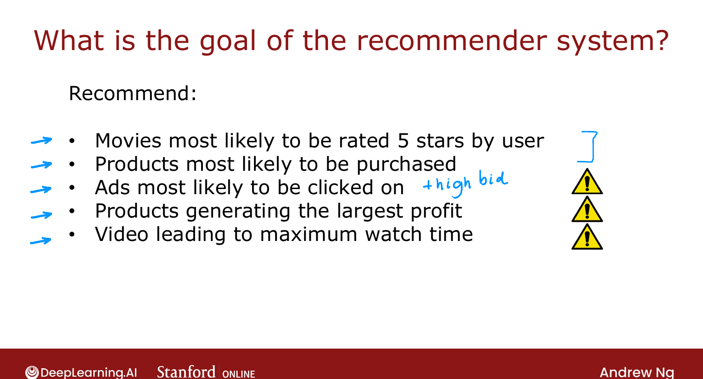
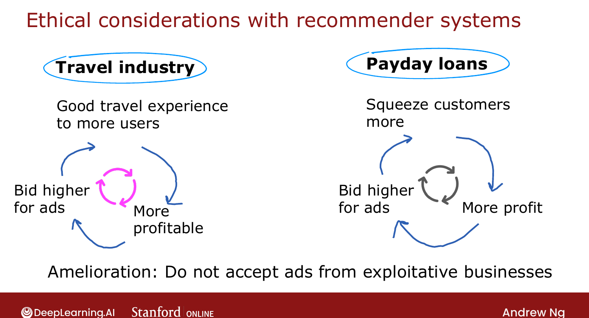
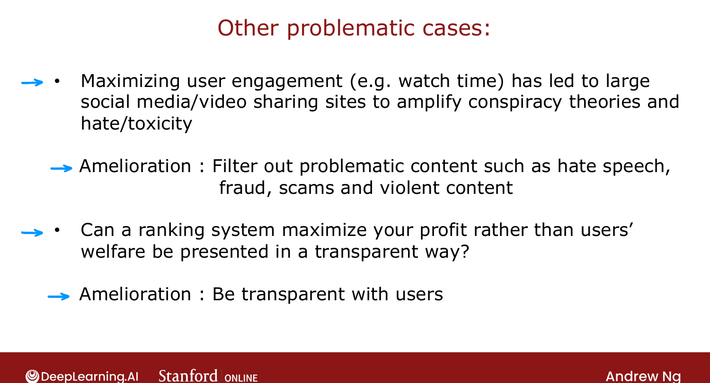

# Ethical Use of Recommender Systems

> **Course 3 · Week 2** · _AI-generated study aid — not authoritative; trust the lecture & cited sources._

[← Recommending from a Large Catalogue](../../course-3/week-2/recommending-from-a-large-catalogue.md){ .md-button }

[TensorFlow Implementation of Content-Based Filtering →](../../course-3/week-2/tensorflow-implementation-of-content-based-filtering.md){ .md-button }

<video controls preload="none" playsinline src="https://dyckms5inbsqq.cloudfront.net/dlai/unsupervised-learning-recommenders-reinforcement-learning/W2/L11-MLS-C3W2L3S04-Ethical-use-of-rec/lc-unsupervised-learning-recommenders-reinforcement-learning-W2-L11-MLS-C3W2L3S04-Ethical-use-of-rec-master_360p.mp4?v=1752487438">Your browser can't play this video — <a href="https://dyckms5inbsqq.cloudfront.net/dlai/unsupervised-learning-recommenders-reinforcement-learning/W2/L11-MLS-C3W2L3S04-Ethical-use-of-rec/lc-unsupervised-learning-recommenders-reinforcement-learning-W2-L11-MLS-C3W2L3S04-Ethical-use-of-rec-master_360p.mp4?v=1752487438">download the lecture</a>.</video>

> 📄 **[Read the full lecture transcript](ethical-use-of-recommender-systems-transcript.md)**

Recommenders are hugely profitable — and some uses have left people and society **worse
off**. This lecture is a call to build them responsibly. `[00:02]`

## The goal you optimize is a choice

Designing a recommender means choosing **what to recommend**, and that choice has ethics
baked in. Some goals seem benign; others are fraught: `[00:35]`

- Movies most likely **rated 5 stars** by the user — fine.
- Products most likely **purchased** — fine.
- Ads most likely **clicked** (often weighted by the advertiser's **bid**) — profit-driven,
  with possible downsides.
- Products that generate the **largest profit** for the company (not the most relevant) —
  opaque to the user.
- Content maximizing **watch time / engagement** — incentivizes keeping you on-site for ads.

The first two are innocuous; the rest *may* be fine or *may* be harmful. `[04:07]`

{ .slide }
_Official C3 slide — what to optimize (DeepLearning.AI / Stanford)._
{ .slide-cap }
## Advertising as an amplifier

Ads amplify whatever is profitable — for better or worse: `[04:32]`

- **Travel (virtuous cycle):** a company that serves travelers well → more profit → can bid
  higher for ads → gets more traffic → serves more travelers. Good businesses get amplified.
- **Payday loans (vicious cycle):** a lender that's best at **squeezing** low-income
  borrowers → more profit → bids higher for ads → gets more traffic → exploits more people.
  Here the **most harmful** companies get amplified. `[05:56]`

{ .slide }
_Official C3 slide — advertising as an amplifier (DeepLearning.AI / Stanford)._
{ .slide-cap }

## Other problematic cases & ameliorations

- **Maximizing engagement** has been widely reported to amplify **conspiracy theories, hate,
  and toxicity** — because that content is highly engaging. Partial fix: **filter out**
  problematic content (hate speech, fraud, violence) — though *defining* it is genuinely hard.
- **Profit-maximizing recommendations** users assume are "for them." Amelioration:
  **transparency** about the criteria you rank by — it builds trust. `[07:50]`

Ng's charge: think through **harm as well as benefit**, invite diverse perspectives, debate,
and only build things you believe leave society **better off**. `[09:50]`

!!! note "Why this sits inside a technical course"
    Ng deliberately puts an ethics lecture *between* the algorithm and its TensorFlow
    implementation — the engineering choices (what label $y$ to predict, what objective to
    optimize) **are** the ethical choices. There's no neutral default.

Last topic of the week: the **TensorFlow implementation** of content-based filtering. `[10:31]`

{ .slide }
_Official C3 slide — problematic cases (DeepLearning.AI / Stanford)._
{ .slide-cap }

[← Recommending from a Large Catalogue](../../course-3/week-2/recommending-from-a-large-catalogue.md){ .md-button }

[TensorFlow Implementation of Content-Based Filtering →](../../course-3/week-2/tensorflow-implementation-of-content-based-filtering.md){ .md-button }

