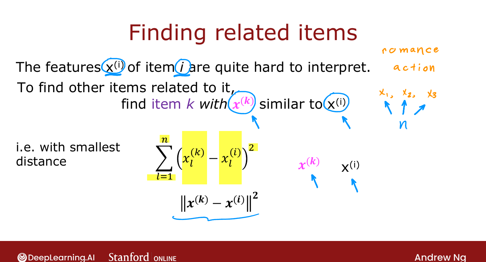
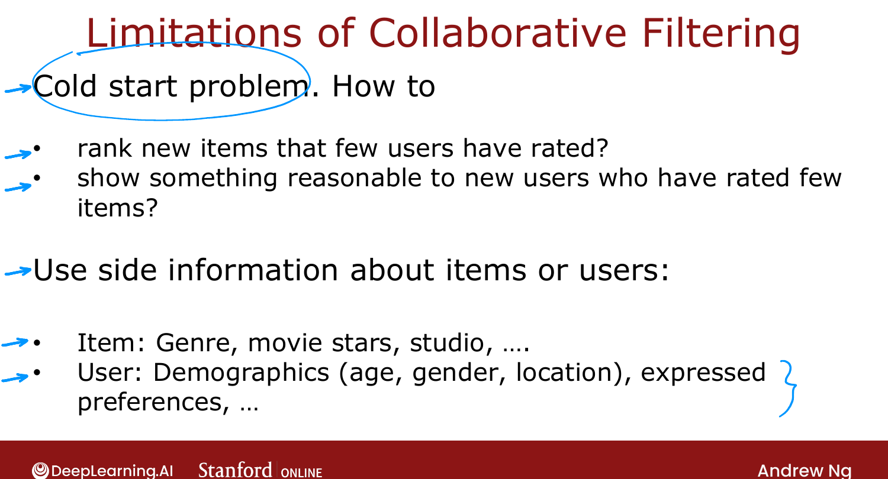

# Finding Related Items

> **Course 3 · Week 2** · _AI-generated study aid — not authoritative; trust the lecture & cited sources._

[← TensorFlow Implementation of Collaborative Filtering](../../course-3/week-2/tensorflow-implementation-of-collaborative-filtering.md){ .md-button }

[Collaborative Filtering vs. Content-Based Filtering →](../../course-3/week-2/collaborative-filtering-vs-content-based-filtering.md){ .md-button }

<video controls preload="none" playsinline src="https://dyckms5inbsqq.cloudfront.net/dlai/unsupervised-learning-recommenders-reinforcement-learning/W2/L7-MLS-C3W2L2S03-Finding-related-it/lc-unsupervised-learning-recommenders-reinforcement-learning-W2-L7-MLS-C3W2L2S03-Finding-related-it-master_360p.mp4?v=1752487438">Your browser can't play this video — <a href="https://dyckms5inbsqq.cloudfront.net/dlai/unsupervised-learning-recommenders-reinforcement-learning/W2/L7-MLS-C3W2L2S03-Finding-related-it/lc-unsupervised-learning-recommenders-reinforcement-learning-W2-L7-MLS-C3W2L2S03-Finding-related-it-master_360p.mp4?v=1752487438">download the lecture</a>.</video>

> 📄 **[Read the full lecture transcript](finding-related-items-transcript.md)**

"Customers who looked at this also liked…" — when a shopping or streaming site shows you
items **similar to the one you're viewing**, collaborative filtering gives a clean way to
do it, reusing the features it already learned. `[00:02]`

## Similarity = distance between learned features

Collaborative filtering learns a feature vector $\vec{x}^{(i)}$ for every item. In practice
these learned features are **hard to interpret** — you can't say "$x_1$ = action, $x_2$ =
romance" — but *collectively* they capture what the item is like. To find items related to
item $i$, find the items $k$ whose features $\vec{x}^{(k)}$ are **closest** to
$\vec{x}^{(i)}$ by **squared distance**: `[01:37]`

$$\big\lVert \vec{x}^{(k)} - \vec{x}^{(i)} \big\rVert^2 = \sum_{l=1}^{n}\big(x^{(k)}_l - x^{(i)}_l\big)^2.$$

Pick the 5–10 items with the smallest distance, and you have your "related items." This
same building block reappears later in more powerful recommenders. `[02:51]`

{ .slide }
_Official C3 slide — related items via feature distance (DeepLearning.AI / Stanford)._
{ .slide-cap }

## Two limitations of collaborative filtering

1. **Cold start.** A brand-new item with almost no ratings is hard to rank; a brand-new
   user who's rated almost nothing is hard to serve. Mean normalization helps the new-user
   case, but only so much. `[03:25]`
2. **No natural way to use side information.** You often *know* a lot about items (genre,
   cast, studio, budget) and users (age, location, device, even browser — Chrome vs. Firefox
   users genuinely behave differently). Plain collaborative filtering ignores all of it. `[04:41]`

{ .slide }
_Official C3 slide — limitations of collaborative filtering (DeepLearning.AI / Stanford)._
{ .slide-cap }

Next: **content-based filtering**, which is built precisely to exploit that side information
and address these weaknesses. `[06:17]`

[← TensorFlow Implementation of Collaborative Filtering](../../course-3/week-2/tensorflow-implementation-of-collaborative-filtering.md){ .md-button }

[Collaborative Filtering vs. Content-Based Filtering →](../../course-3/week-2/collaborative-filtering-vs-content-based-filtering.md){ .md-button }

