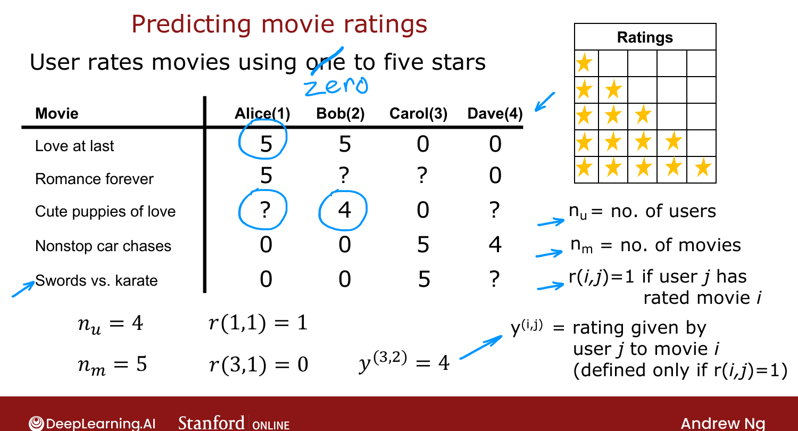

# Making Recommendations

> **Course 3 · Week 2** · _AI-generated study aid — not authoritative; trust the lecture & cited sources._

[← Choosing What Features to Use](../../course-3/week-1/choosing-what-features-to-use.md){ .md-button }

[Using Per-Item Features →](../../course-3/week-2/using-per-item-features.md){ .md-button }

<video controls preload="none" playsinline src="https://dyckms5inbsqq.cloudfront.net/dlai/unsupervised-learning-recommenders-reinforcement-learning/W2/L1-MLS-C3W2L1S01-making-recommendat/lc-unsupervised-learning-recommenders-reinforcement-learning-W2-L1-MLS-C3W2L1S01-making-recommendat-master_360p.mp4?v=1752487437">Your browser can't play this video — <a href="https://dyckms5inbsqq.cloudfront.net/dlai/unsupervised-learning-recommenders-reinforcement-learning/W2/L1-MLS-C3W2L1S01-making-recommendat/lc-unsupervised-learning-recommenders-reinforcement-learning-W2-L1-MLS-C3W2L1S01-making-recommendat-master_360p.mp4?v=1752487437">download the lecture</a>.</video>

> 📄 **[Read the full lecture transcript](making-recommendations-transcript.md)**

**Recommender systems** drive a large fraction of sales at companies like Amazon and Netflix
— arguably more commercially impactful than the academic attention they get. `[00:25]`

## The movie-rating setup

Running example: a movie-streaming site where users rate movies **0–5 stars**. Four users
(Alice, Bob, Carol, Dave) and five movies, but **not every user has rated every movie**. `[01:21]`

{ .slide }
_Official C3 slide — the movie-rating recommender setup (DeepLearning.AI / Stanford)._
{ .slide-cap }

## Notation

- $n_u$ = number of **users** (4 here); $n_m$ = number of **movies/items** (5 here).
- $r(i,j) = 1$ if user $j$ has **rated** movie $i$, else $0$.
- $y(i,j)$ = the **rating** user $j$ gave movie $i$ (only defined when $r(i,j)=1$).

It matters which users rated which movies, which is why $r(i,j)$ tracks the missing entries. `[04:27]`

## The goal

Predict how users would rate movies they **haven't** rated, so you can recommend the ones
they'd likely rate highly. The framework works for any items — products, restaurants,
articles, not just movies. `[04:38]`

Next: a first algorithm, assuming for now that we have **features** describing each movie
(how "romance" vs. "action" it is). `[05:05]`

[← Choosing What Features to Use](../../course-3/week-1/choosing-what-features-to-use.md){ .md-button }

[Using Per-Item Features →](../../course-3/week-2/using-per-item-features.md){ .md-button }

