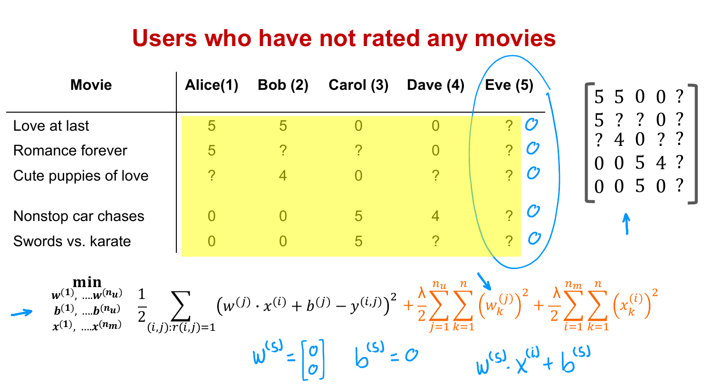
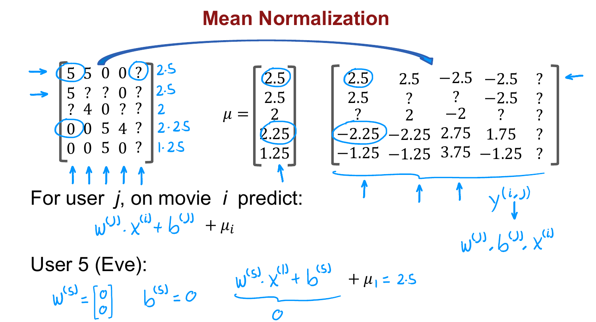

# Mean Normalization

> **Course 3 · Week 2** · _AI-generated study aid — not authoritative; trust the lecture & cited sources._

[← Binary Labels: Favs, Likes and Clicks](../../course-3/week-2/binary-labels-favs-likes-and-clicks.md){ .md-button }

[TensorFlow Implementation of Collaborative Filtering →](../../course-3/week-2/tensorflow-implementation-of-collaborative-filtering.md){ .md-button }

<video controls preload="none" playsinline src="https://dyckms5inbsqq.cloudfront.net/dlai/unsupervised-learning-recommenders-reinforcement-learning/W2/L5-MLS-C3W2L2S01-mean-normalization/lc-unsupervised-learning-recommenders-reinforcement-learning-W2-L5-MLS-C3W2L2S01-mean-normalization-master_360p.mp4?v=1752487437">Your browser can't play this video — <a href="https://dyckms5inbsqq.cloudfront.net/dlai/unsupervised-learning-recommenders-reinforcement-learning/W2/L5-MLS-C3W2L2S01-mean-normalization/lc-unsupervised-learning-recommenders-reinforcement-learning-W2-L5-MLS-C3W2L2S01-mean-normalization-master_360p.mp4?v=1752487437">download the lecture</a>.</video>

> 📄 **[Read the full lecture transcript](mean-normalization-transcript.md)**

Just as feature normalization sped up linear regression in Course 1, **mean normalization**
makes the recommender run faster **and** — more importantly — behave far more sensibly for
users who've rated few or no movies. `[00:02]`

## The new-user problem

Add a fifth user, **Eve**, who hasn't rated anything. Because the regularization term
pushes $\vec{w}$ small, and none of Eve's (nonexistent) ratings enter the squared-error
term, the algorithm just sets $\vec{w}^{(5)}=[0,0]$ and $b^{(5)}=0$. Then it predicts Eve
rates **every** movie $\vec{w}^{(5)}\cdot\vec{x}^{(i)} + b^{(5)} = 0$ stars — useless. `[01:02]`

{ .slide }
_Official C3 slide — why a new user defaults to all-zero predictions (DeepLearning.AI / Stanford)._
{ .slide-cap }

## The fix: subtract each movie's mean

Gather every movie's **average rating** (over just the users who rated it) into a vector
$\mu$ (e.g. movie 1 averaged $2.5$). Subtract $\mu_i$ from every rating, and learn
$\vec{w}, b, \vec{x}$ on these **mean-centered** values. To predict, **add $\mu_i$ back**: `[04:54]`

$$\text{prediction for user } j \text{ on movie } i = \vec{w}^{(j)}\cdot\vec{x}^{(i)} + b^{(j)} + \mu_i.$$

Now for Eve the algorithm predicts $0 + 0 + \mu_i = \mu_i$ — i.e. **the average rating other
users gave that movie**. Guessing the crowd average for a brand-new user is far more
reasonable than guessing zero. `[06:05]`

{ .slide }
_Official C3 slide — mean normalization restores sensible defaults (DeepLearning.AI / Stanford)._
{ .slide-cap }

## Rows vs. columns

Here we normalized **rows** (per-movie means) to help **new users**. You *could* instead
normalize **columns** (per-user means) to help a **brand-new movie** no one's rated — but
a movie with zero ratings probably shouldn't be widely shown yet anyway, so helping new
users matters more in practice. `[07:04]`

Next: how to implement collaborative filtering in **TensorFlow**, leaning on its automatic
differentiation. `[08:09]`

[← Binary Labels: Favs, Likes and Clicks](../../course-3/week-2/binary-labels-favs-likes-and-clicks.md){ .md-button }

[TensorFlow Implementation of Collaborative Filtering →](../../course-3/week-2/tensorflow-implementation-of-collaborative-filtering.md){ .md-button }

