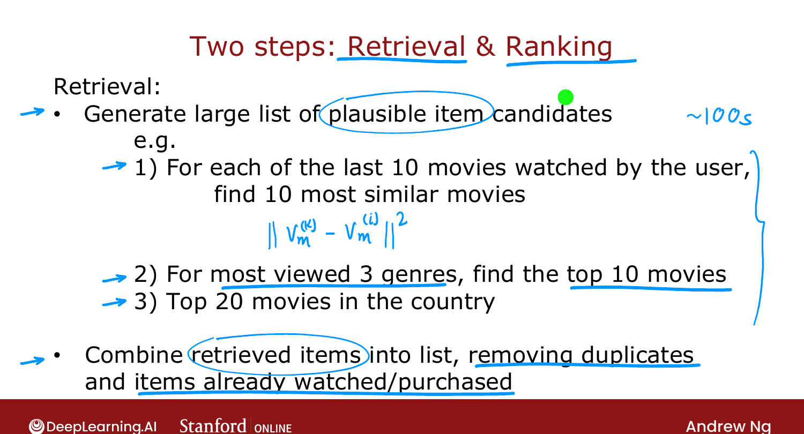
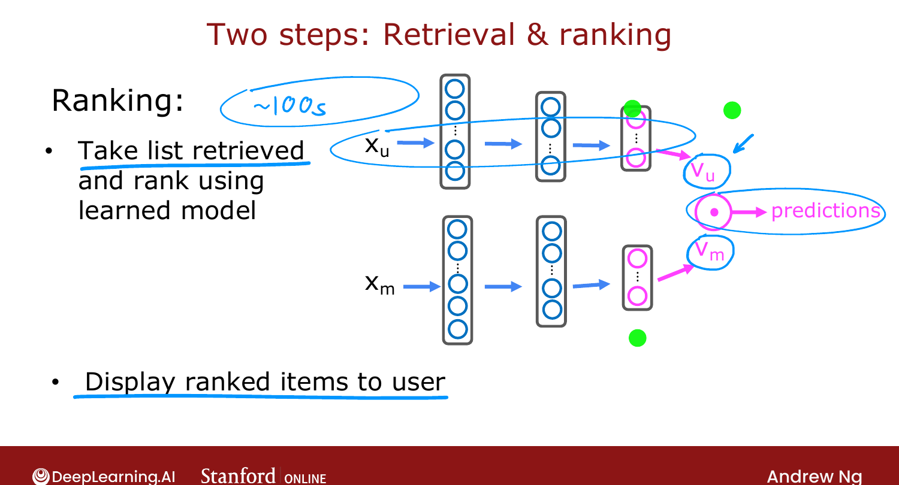
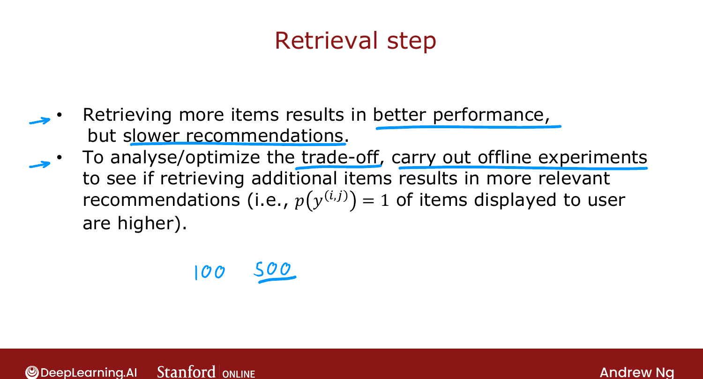

# Recommending from a Large Catalogue

> **Course 3 · Week 2** · _AI-generated study aid — not authoritative; trust the lecture & cited sources._

[← Deep Learning for Content-Based Filtering](../../course-3/week-2/deep-learning-for-content-based-filtering.md){ .md-button }

[Ethical Use of Recommender Systems →](../../course-3/week-2/ethical-use-of-recommender-systems.md){ .md-button }

<video controls preload="none" playsinline src="https://dyckms5inbsqq.cloudfront.net/dlai/unsupervised-learning-recommenders-reinforcement-learning/W2/L10-MLS-C3W2L3S03-Recommending-from-/lc-unsupervised-learning-recommenders-reinforcement-learning-W2-L10-MLS-C3W2L3S03-Recommending-from--master_360p.mp4?v=1752487438">Your browser can't play this video — <a href="https://dyckms5inbsqq.cloudfront.net/dlai/unsupervised-learning-recommenders-reinforcement-learning/W2/L10-MLS-C3W2L3S03-Recommending-from-/lc-unsupervised-learning-recommenders-reinforcement-learning-W2-L10-MLS-C3W2L3S03-Recommending-from--master_360p.mp4?v=1752487438">download the lecture</a>.</video>

> 📄 **[Read the full lecture transcript](recommending-from-a-large-catalogue-transcript.md)**

Real systems must pick a few items from catalogues of **millions** — movies, ads, songs,
products. Running the neural network over every item each time a user shows up is
computationally infeasible. The fix: a **two-step retrieval + ranking** pipeline. `[00:00]`

## Why brute force fails

A streaming site has thousands of movies; an ad system millions of ads; a music or shopping
site tens of millions. Feeding every item's $\vec{v}_m$ through the network per visit, every
visit, doesn't scale. `[00:22]`

## Step 1 — Retrieval (cheap, broad)

Generate a **large candidate list** that's likely to *cover* good items — it's fine if it
also includes junk. For example: `[01:53]`

- For each of the user's last 10 watched movies, look up the 10 most similar (these
  similar-item lists were **pre-computed** — just a table lookup).
- Add the top 10 movies in each of the user's 3 most-watched genres.
- Add the top 20 movies in the user's country.

Combine into ~100s of candidates; remove duplicates and already-watched/purchased items.
The goal is **broad coverage**, fast. `[03:48]`

{ .slide }
_Official C3 slide — the retrieval step (DeepLearning.AI / Stanford)._
{ .slide-cap }

## Step 2 — Ranking (accurate, narrow)

Take just those few hundred candidates and rank them with the **learned model**: feed each
(user, movie) pair through the network and predict the rating, then display in order. Key
optimization: since every movie's $\vec{v}_m$ is **pre-computed**, you run the **user network
once** to get $\vec{v}_u$, then just take dot products $\vec{v}_u \cdot \vec{v}_m$ over the
retrieved set — cheap. `[04:04]`

{ .slide }
_Official C3 slide — the ranking step (DeepLearning.AI / Stanford)._
{ .slide-cap }
## How many to retrieve?

More candidates → better recommendations but slower. Tune via **offline experiments**: check
whether retrieving, say, 500 instead of 100 meaningfully raises the predicted relevance of
what's shown. If yes, retrieving more is worth the slowdown. `[05:25]`

{ .slide }
_Official C3 slide — retrieval size trade-off (DeepLearning.AI / Stanford)._
{ .slide-cap }

Next: the **ethical** dimension — recommenders are powerful enough to cause real harm. `[07:08]`

[← Deep Learning for Content-Based Filtering](../../course-3/week-2/deep-learning-for-content-based-filtering.md){ .md-button }

[Ethical Use of Recommender Systems →](../../course-3/week-2/ethical-use-of-recommender-systems.md){ .md-button }

