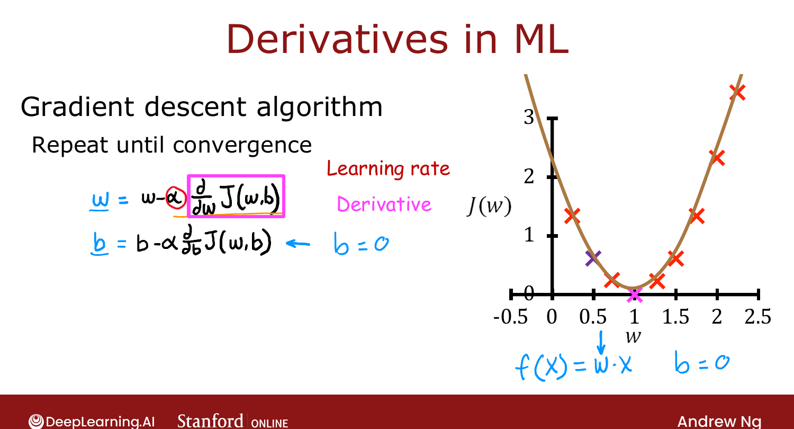

# TensorFlow Implementation of Collaborative Filtering

> **Course 3 · Week 2** · _AI-generated study aid — not authoritative; trust the lecture & cited sources._

<div class="ep-nav" markdown>

[← Mean Normalization](../../course-3/week-2/mean-normalization.md){ .md-button }

[Finding Related Items →](../../course-3/week-2/finding-related-items.md){ .md-button }

</div>

<div class="video-wrap"><video controls preload="none" playsinline src="https://dyckms5inbsqq.cloudfront.net/dlai/unsupervised-learning-recommenders-reinforcement-learning/W2/L6-MLS-C3W2L2S02-TensorFlow-impleme/lc-unsupervised-learning-recommenders-reinforcement-learning-W2-L6-MLS-C3W2L2S02-TensorFlow-impleme-master_360p.mp4?v=1752487437">Your browser can't play this video — <a href="https://dyckms5inbsqq.cloudfront.net/dlai/unsupervised-learning-recommenders-reinforcement-learning/W2/L6-MLS-C3W2L2S02-TensorFlow-impleme/lc-unsupervised-learning-recommenders-reinforcement-learning-W2-L6-MLS-C3W2L2S02-TensorFlow-impleme-master_360p.mp4?v=1752487437">download the lecture</a>.</video></div>

> 📄 **[Read the full lecture transcript](tensorflow-implementation-of-collaborative-filtering-transcript.md)**

TensorFlow isn't only for neural networks — it's a great tool for the collaborative-filtering
algorithm too, mainly because of one feature: it can compute the **derivatives of your cost
function automatically**. `[00:02]`

## Why AutoDiff helps here

To run gradient descent you normally need the partial-derivative term
$\frac{\partial}{\partial w} J$. The collaborative-filtering cost is non-standard, so those
derivatives are awkward to derive by hand. TensorFlow's trick: **you only implement the
cost $J$**, and it figures out the derivatives for you — no calculus required. `[00:27]`

## Gradient Tape

Recall from Course 1: with $b=0$, gradient descent on a simple cost
$J = (wx - 1)^2$ repeats $w := w - \alpha\,\frac{\partial J}{\partial w}$ until convergence.
In TensorFlow you wrap the cost computation in a **`tf.GradientTape`**, which records the
sequence of operations so it can replay them backward to get the gradient: `[02:13]`

```python
w = tf.Variable(3.0)          # a Variable = a parameter to optimize
x, y, alpha = 1.0, 1.0, 0.01

for _ in range(30):
    with tf.GradientTape() as tape:     # record the ops...
        fx = w * x
        J  = (fx - y) ** 2              # ...just implement the cost
    dJdw = tape.gradient(J, [w])        # AutoDiff: ∂J/∂w, for free
    w.assign_add(-alpha * dJdw[0])      # Variables need assign_add, not w = …
```

Telling TensorFlow `w = tf.Variable(...)` is how you declare it a parameter to optimize;
`tape.gradient(J, [w])` returns $\frac{\partial J}{\partial w}$ automatically. Repeating
the update walks $w$ from $3$ to its optimum $w=1$. `[03:07]`

{ .slide }
_Official C3 slide — AutoDiff via `tf.GradientTape` (DeepLearning.AI / Stanford)._
{ .slide-cap }

## AutoDiff

This feature is called **automatic differentiation** (AutoDiff) — sometimes loosely
"AutoGrad." Other frameworks like **PyTorch** support it too. For collaborative filtering,
you implement the combined cost (over $\vec{w}, b, \vec{x}$), wrap it in a gradient tape,
and let AutoDiff drive the optimizer (the practice lab uses Adam rather than plain gradient
descent). You never hand-derive the recommender's gradients. `[05:50]`

!!! note "Source: Nielsen, *Neural Networks and Deep Learning* (Ch. 2)"
    Nielsen's backpropagation chapter is exactly the algorithm AutoDiff automates: applying
    the chain rule backward through a recorded computation graph. The gradient tape here is
    the same idea Ng introduced as the computation graph in **Course 2, Week 2**.

Next: a neat by-product of the learned features — **finding related items**. `[06:50]`


<div class="ep-nav" markdown>

[← Mean Normalization](../../course-3/week-2/mean-normalization.md){ .md-button }

[Finding Related Items →](../../course-3/week-2/finding-related-items.md){ .md-button }

</div>
