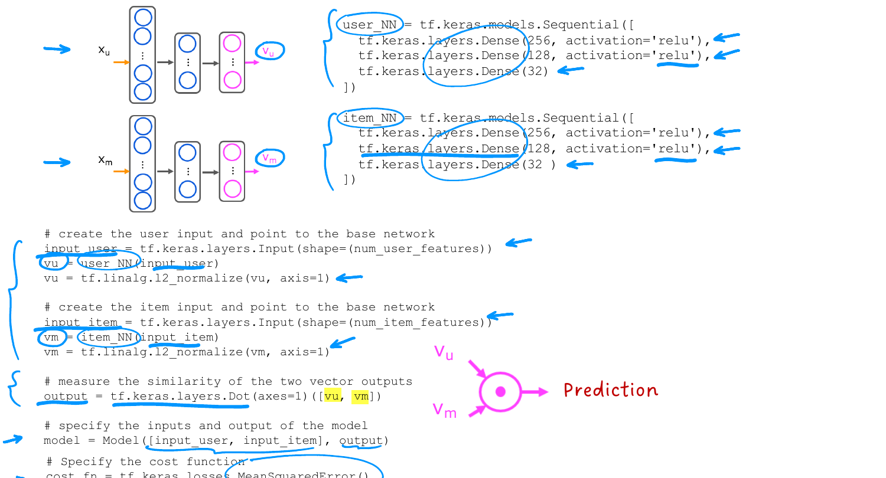

# TensorFlow Implementation of Content-Based Filtering

> **Course 3 · Week 2** · _AI-generated study aid — not authoritative; trust the lecture & cited sources._

<div class="ep-nav" markdown>

[← Ethical Use of Recommender Systems](../../course-3/week-2/ethical-use-of-recommender-systems.md){ .md-button }

[Reducing the Number of Features (PCA) →](../../course-3/week-2/reducing-the-number-of-features.md){ .md-button }

</div>

<div class="video-wrap"><video controls preload="none" playsinline src="https://dyckms5inbsqq.cloudfront.net/dlai/unsupervised-learning-recommenders-reinforcement-learning/W2/L12-MLS-C3W2L3S05-TensorFlow-impleme/lc-unsupervised-learning-recommenders-reinforcement-learning-W2-L12-MLS-C3W2L3S05-TensorFlow-impleme-master_360p.mp4?v=1752487439">Your browser can't play this video — <a href="https://dyckms5inbsqq.cloudfront.net/dlai/unsupervised-learning-recommenders-reinforcement-learning/W2/L12-MLS-C3W2L3S05-TensorFlow-impleme/lc-unsupervised-learning-recommenders-reinforcement-learning-W2-L12-MLS-C3W2L3S05-TensorFlow-impleme-master_360p.mp4?v=1752487439">download the lecture</a>.</video></div>

> 📄 **[Read the full lecture transcript](tensorflow-implementation-of-content-based-filtering-transcript.md)**

The content-based recommender is just two `Sequential` networks joined by a dot product —
implemented in Keras with the same dense layers you already know. `[00:01]`

## The two networks

Each tower is an ordinary `Sequential` model of dense ReLU layers whose **final layer
outputs 32 numbers** ($\vec{v}_u$ and $\vec{v}_m$): `[00:15]`

```python
user_NN = tf.keras.models.Sequential([
    tf.keras.layers.Dense(256, activation='relu'),
    tf.keras.layers.Dense(128, activation='relu'),
    tf.keras.layers.Dense(32),               # outputs v_u (32 numbers)
])
item_NN = tf.keras.models.Sequential([
    tf.keras.layers.Dense(256, activation='relu'),
    tf.keras.layers.Dense(128, activation='relu'),
    tf.keras.layers.Dense(32),               # outputs v_m (32 numbers)
])
```

## Wire features in, normalize, dot product

Feed each side's features through its network, **L2-normalize** the output to length 1 (a
small step that makes the algorithm work a bit better), then take the dot product with a
dedicated `Dot` layer: `[01:12]`

```python
input_user = tf.keras.layers.Input(shape=(num_user_features,))
vu = user_NN(input_user)
vu = tf.linalg.l2_normalize(vu, axis=1)      # normalize length to 1

input_item = tf.keras.layers.Input(shape=(num_item_features,))
vm = item_NN(input_item)
vm = tf.linalg.l2_normalize(vm, axis=1)

output = tf.keras.layers.Dot(axes=1)([vu, vm])   # special Dot layer = v_u · v_m

model = tf.keras.Model([input_user, input_item], output)
model.compile(loss=tf.keras.losses.MeanSquaredError())
```

Note the two new pieces vs. earlier networks: `tf.keras.layers.Dot` (a layer that just dot-
products two vectors) and `tf.linalg.l2_normalize` (rescales $\vec{v}$ to unit length). The
model is trained end-to-end with **mean-squared-error** loss — one cost, both towers. `[03:21]`

{ .slide }
_Official C3 slide — content-based filtering in TensorFlow (DeepLearning.AI / Stanford)._
{ .slide-cap }

!!! abstract "Source: Prince, *Understanding Deep Learning* §9.3.2 (normalization)"
    The unit-normalization of $\vec{v}_u, \vec{v}_m$ turns the dot product into a **cosine
    similarity** — comparing *directions*, not magnitudes. Prince notes this stabilizes
    matching/retrieval objectives, which is why the lab adds the L2-normalize step.

That closes recommender systems. **Course 3, Week 3 is reinforcement learning** — but this
week also continues with **PCA** (dimensionality reduction). Up next: reducing the number of
features. `[03:51]`


<div class="ep-nav" markdown>

[← Ethical Use of Recommender Systems](../../course-3/week-2/ethical-use-of-recommender-systems.md){ .md-button }

[Reducing the Number of Features (PCA) →](../../course-3/week-2/reducing-the-number-of-features.md){ .md-button }

</div>
