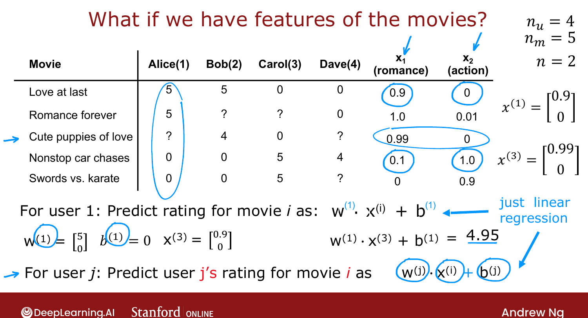
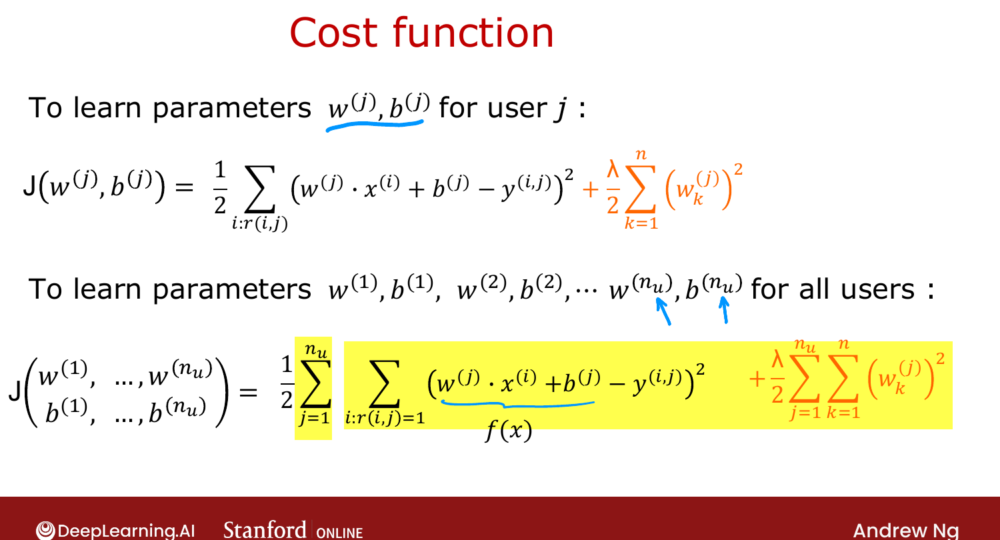

# Using Per-Item Features

> **Course 3 · Week 2** · _AI-generated study aid — not authoritative; trust the lecture & cited sources._

[← Making Recommendations](../../course-3/week-2/making-recommendations.md){ .md-button }

[Collaborative Filtering Algorithm →](../../course-3/week-2/collaborative-filtering-algorithm.md){ .md-button }

<video controls preload="none" playsinline src="https://dyckms5inbsqq.cloudfront.net/dlai/unsupervised-learning-recommenders-reinforcement-learning/W2/L2-MLS-C3W2L1S02-using-per-item-fea/lc-unsupervised-learning-recommenders-reinforcement-learning-W2-L2-MLS-C3W2L1S02-using-per-item-fea-master_360p.mp4?v=1752487437">Your browser can't play this video — <a href="https://dyckms5inbsqq.cloudfront.net/dlai/unsupervised-learning-recommenders-reinforcement-learning/W2/L2-MLS-C3W2L1S02-using-per-item-fea/lc-unsupervised-learning-recommenders-reinforcement-learning-W2-L2-MLS-C3W2L1S02-using-per-item-fea-master_360p.mp4?v=1752487437">download the lecture</a>.</video>

> 📄 **[Read the full lecture transcript](using-per-item-features-transcript.md)**

If we have **features** for each movie, recommending becomes a per-user **linear regression**. `[00:02]`

## Features and the prediction

Add two features per movie: $x_1$ = how much romance, $x_2$ = how much action (so "Love at
Last" is $[0.9, 0]$, "Nonstop Car Chases" is $[0.1, 1.0]$). With $n=2$ features, predict
user $j$'s rating of movie $i$ as: `[03:46]`

$$\text{prediction} = \vec{w}^{(j)}\cdot \vec{x}^{(i)} + b^{(j)}.$$

This is **linear regression — one model per user**. E.g. for Alice with $\vec{w}^{(1)}=[5,0],
b^{(1)}=0$, "Cute Puppies of Love" $\vec{x}=[0.99,0]$ predicts $0.99\times5 = 4.95$ — plausible,
since she rates romance high and action low. `[03:00]`

{ .slide }
_Official C3 slide — predicting ratings with movie features (DeepLearning.AI / Stanford)._
{ .slide-cap }

## Cost function

Let $m^{(j)}$ = number of movies user $j$ rated. To learn $\vec{w}^{(j)}, b^{(j)}$, minimize
the squared error **over only the movies that user rated** ($r(i,j)=1$), plus regularization: `[06:01]`

$$J(\vec{w}^{(j)}, b^{(j)}) = \frac{1}{2}\!\!\sum_{i:\,r(i,j)=1}\!\!\big(\vec{w}^{(j)}\!\cdot\vec{x}^{(i)} + b^{(j)} - y(i,j)\big)^2 + \frac{\lambda}{2}\sum_{k=1}^{n}\big(w^{(j)}_k\big)^2.$$

(For recommenders it's convenient to **drop** the $\frac{1}{m^{(j)}}$ factor — it's a constant
and doesn't change the optimal $\vec{w}, b$.) To learn **all** users' parameters, **sum** this
over $j = 1 \dots n_u$. `[10:11]`

{ .slide }
_Official C3 slide — the cost over all users (DeepLearning.AI / Stanford)._
{ .slide-cap }

But where do features $x_1, x_2$ come from? What if we **don't** have them? Next:
**collaborative filtering** learns the features from the data. `[10:56]`

[← Making Recommendations](../../course-3/week-2/making-recommendations.md){ .md-button }

[Collaborative Filtering Algorithm →](../../course-3/week-2/collaborative-filtering-algorithm.md){ .md-button }

