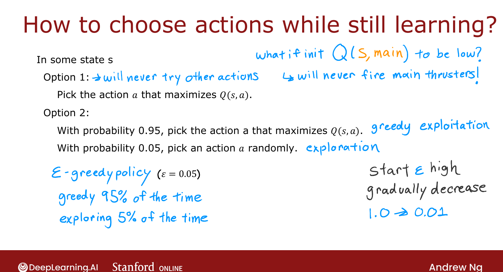

# Algorithm Refinement: ε-Greedy Policy

> **Course 3 · Week 3** · _AI-generated study aid — not authoritative; trust the lecture & cited sources._

[← Algorithm Refinement: Improved Neural Network Architecture](../../course-3/week-3/algorithm-refinement-improved-neural-network-architecture.md){ .md-button }

[Algorithm Refinement: Mini-Batch and Soft Updates →](../../course-3/week-3/algorithm-refinement-mini-batch-and-soft-updates.md){ .md-button }

<video controls preload="none" playsinline src="https://dyckms5inbsqq.cloudfront.net/dlai/unsupervised-learning-recommenders-reinforcement-learning/W3/L14-MLS-C3W3L3S05-algorithm-refineme/lc-unsupervised-learning-recommenders-reinforcement-learning-W3-L14-MLS-C3W3L3S05-algorithm-refineme-master_360p.mp4?v=1752487442">Your browser can't play this video — <a href="https://dyckms5inbsqq.cloudfront.net/dlai/unsupervised-learning-recommenders-reinforcement-learning/W3/L14-MLS-C3W3L3S05-algorithm-refineme/lc-unsupervised-learning-recommenders-reinforcement-learning-W3-L14-MLS-C3W3L3S05-algorithm-refineme-master_360p.mp4?v=1752487442">download the lecture</a>.</video>

> 📄 **[Read the full lecture transcript](algorithm-refinement-epsilon-greedy-policy-transcript.md)**

While still learning $Q$, you must take actions to gather experience. How do you pick them
when your $Q$ estimate is still poor? The standard answer: an **ε-greedy policy**. `[00:02]`

## Greedy vs. exploring

- **Option 1 (pure greedy):** always take $\arg\max_a Q(s,a)$ using the current estimate.
  Works okay, but risky.
- **Option 2 (ε-greedy):** with probability $1-\varepsilon$ (say 0.95) take the greedy action;
  with probability $\varepsilon$ (say 0.05) take a **random** action. `[00:54]`

{ .slide }
_Official C3 slide — choosing actions while learning (DeepLearning.AI / Stanford)._
{ .slide-cap }

## Why explore?

If random initialization makes the network wrongly believe "firing the main thruster is never
good," a pure-greedy policy will **never try it** — and so never discover it's useful. The
occasional random action is an **exploration step** that lets the network overcome its own
preconceptions. `[02:02]`

The terminology: a greedy action is **exploitation** (use what you know); a random action is
**exploration** (learn more) — the **exploration–exploitation trade-off**. `[03:46]`

!!! tip "The name is backwards, and ε should decay"
    With $\varepsilon = 0.05$ you're greedy **95%** of the time — "1−ε greedy" would be a more
    honest name, but "ε-greedy" stuck. A common trick: **start ε high** (even 1.0 = all
    random) and **gradually decay** it (down to ~0.01) so you explore early and exploit once
    $Q$ is good. `[05:38]`

!!! warning "RL is finicky with hyperparameters"
    Ng notes RL is **much** more sensitive to hyperparameters than supervised learning: a
    poorly-set learning rate might make supervised learning 3× slower, but a bad ε can make RL
    take **10–100×** longer. The lab provides good values. `[07:07]`

Next (optional): two more refinements — **mini-batches** and **soft updates**. `[08:22]`

[← Algorithm Refinement: Improved Neural Network Architecture](../../course-3/week-3/algorithm-refinement-improved-neural-network-architecture.md){ .md-button }

[Algorithm Refinement: Mini-Batch and Soft Updates →](../../course-3/week-3/algorithm-refinement-mini-batch-and-soft-updates.md){ .md-button }

