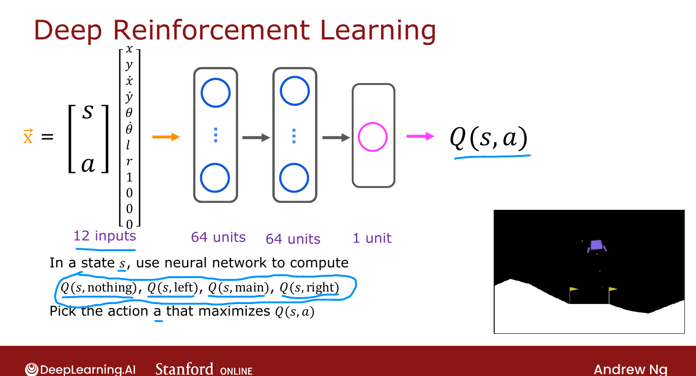

# Algorithm Refinement: Improved Neural Network Architecture

> **Course 3 · Week 3** · _AI-generated study aid — not authoritative; trust the lecture & cited sources._

[← Learning the State-Value Function](../../course-3/week-3/learning-the-state-value-function.md){ .md-button }

[Algorithm Refinement: ε-Greedy Policy →](../../course-3/week-3/algorithm-refinement-epsilon-greedy-policy.md){ .md-button }

<video controls preload="none" playsinline src="https://dyckms5inbsqq.cloudfront.net/dlai/unsupervised-learning-recommenders-reinforcement-learning/W3/L13-MLS-C3W3L3S04-algorithm-refineme/lc-unsupervised-learning-recommenders-reinforcement-learning-W3-L13-MLS-C3W3L3S04-algorithm-refineme-master_360p.mp4?v=1752487442">Your browser can't play this video — <a href="https://dyckms5inbsqq.cloudfront.net/dlai/unsupervised-learning-recommenders-reinforcement-learning/W3/L13-MLS-C3W3L3S04-algorithm-refineme/lc-unsupervised-learning-recommenders-reinforcement-learning-W3-L13-MLS-C3W3L3S04-algorithm-refineme-master_360p.mp4?v=1752487442">download the lecture</a>.</video>

> 📄 **[Read the full lecture transcript](algorithm-refinement-improved-neural-network-architecture-transcript.md)**

A small architecture change makes DQN **much more efficient** — most real implementations use
it. `[00:02]`

## The problem with the old architecture

The previous network input (state, action) = 12 numbers and output a **single** $Q(s,a)$. To
pick the best action in a state, you had to run **inference 4 times** (once per action). That's
wasteful. `[00:27]`

## The fix: one network, four outputs

Input just the **8 state numbers**; keep the two 64-unit hidden layers; but make the **output
layer have 4 units**, one per action: `[01:01]`

$$\text{outputs} = \big[\,Q(s, \text{nothing}),\; Q(s, \text{left}),\; Q(s, \text{main}),\; Q(s, \text{right})\,\big].$$

Now a **single** inference gives all four $Q$ values — pick the max action instantly.

{ .slide }
_Official C3 slide — the efficient single-network architecture (DeepLearning.AI / Stanford)._
{ .slide-cap }

This also speeds up the **Bellman target** $R(s) + \gamma\max_{a'}Q(s', a')$: one forward pass
on $s'$ yields all $Q(s', a')$, so the max is immediate. This is the architecture used in the
practice lab. `[02:04]`

Next: the **ε-greedy** policy — how to choose actions while still learning. `[02:52]`

[← Learning the State-Value Function](../../course-3/week-3/learning-the-state-value-function.md){ .md-button }

[Algorithm Refinement: ε-Greedy Policy →](../../course-3/week-3/algorithm-refinement-epsilon-greedy-policy.md){ .md-button }

