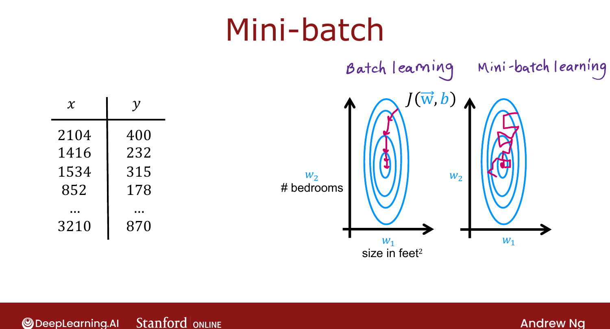
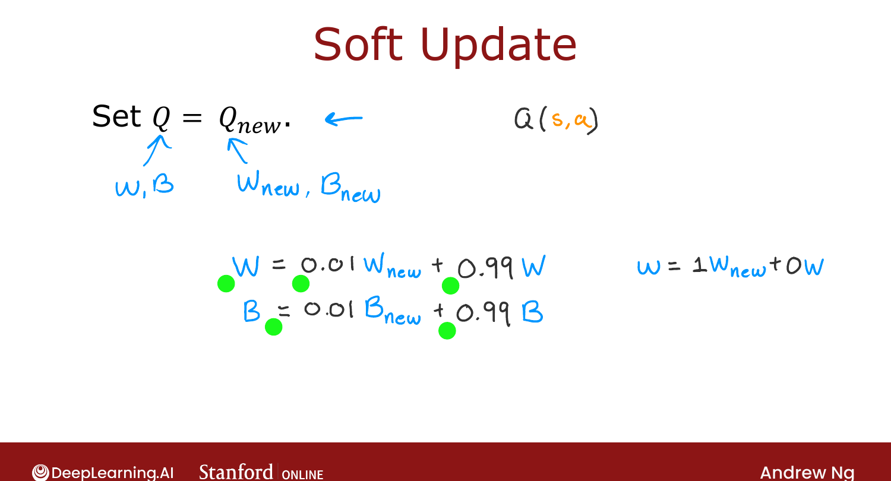

# Algorithm Refinement: Mini-Batch and Soft Updates

> **Course 3 · Week 3** · _AI-generated study aid — not authoritative; trust the lecture & cited sources._

[← Algorithm Refinement: ε-Greedy Policy](../../course-3/week-3/algorithm-refinement-epsilon-greedy-policy.md){ .md-button }

[The State of Reinforcement Learning →](../../course-3/week-3/the-state-of-reinforcement-learning.md){ .md-button }

<video controls preload="none" playsinline src="https://dyckms5inbsqq.cloudfront.net/dlai/unsupervised-learning-recommenders-reinforcement-learning/W3/L15-MLS-C3W3L3S06-algorithm-refineme/lc-unsupervised-learning-recommenders-reinforcement-learning-W3-L15-MLS-C3W3L3S06-algorithm-refineme-master_360p.mp4?v=1752487443">Your browser can't play this video — <a href="https://dyckms5inbsqq.cloudfront.net/dlai/unsupervised-learning-recommenders-reinforcement-learning/W3/L15-MLS-C3W3L3S06-algorithm-refineme/lc-unsupervised-learning-recommenders-reinforcement-learning-W3-L15-MLS-C3W3L3S06-algorithm-refineme-master_360p.mp4?v=1752487443">download the lecture</a>.</video>

> 📄 **[Read the full lecture transcript](algorithm-refinement-mini-batch-and-soft-updates-transcript.md)**

_(Optional.)_ Two refinements: **mini-batches** (speed) and **soft updates** (stability).
Mini-batching applies to supervised learning too. `[00:02]`

## Mini-batch gradient descent

Recall linear regression's cost $J = \frac{1}{2m}\sum_{i=1}^{m}(f(x^{(i)}) - y^{(i)})^2$. If
$m$ is huge (say **100 million** housing units), **every** gradient-descent step must average
over all 100M examples before taking one tiny step — very slow. `[00:40]`

**Mini-batch** instead uses a small subset of $m' = 1000$ examples per step, rotating through
different subsets: `[02:59]`

$$\text{each step uses}\quad \frac{1}{2m'}\sum_{i \in \text{batch}}(f(x^{(i)}) - y^{(i)})^2.$$

Each step is far cheaper. The path to the minimum is **noisier** — individual steps may even
head the wrong way — but **on average** it trends toward the minimum, much faster overall.
With big datasets, mini-batch (often with **Adam**) is more common than full-batch. `[06:02]`

{ .slide }
_Official C3 slide — batch vs. mini-batch gradient descent (DeepLearning.AI / Stanford)._
{ .slide-cap }

**In DQN:** even with 10,000 tuples in the replay buffer, train on a **subset of ~1000** each
iteration — noisier but faster. `[06:40]`

## Soft updates

The step "set $Q = Q_{\text{new}}$" is abrupt: if an unlucky training run produces a *worse*
$Q_{\text{new}}$, you've overwritten a good $Q$ with a bad one. A **soft update** blends them
instead: `[08:02]`

$$W \leftarrow 0.01\,W_{\text{new}} + 0.99\,W, \qquad B \leftarrow 0.01\,B_{\text{new}} + 0.99\,B.$$

You accept only 1% of the new parameters each time (the 0.01/0.99 are hyperparameters summing
to 1; setting them to 1/0 recovers the abrupt copy). This gradual change makes RL **converge
more reliably** — less oscillation/divergence. `[10:31]`

!!! note "Source: Lillicrap et al. 2016 (DDPG) — Polyak/soft target updates"
    The soft (Polyak-averaged) **target-network** update Ng describes is the stabilization
    trick from the deep-RL literature; slowly-tracking targets keep the Bellman regression
    from chasing a moving goal.

With the efficient architecture, ε-greedy, mini-batches, and soft updates, the lander lands.

{ .slide }
_Official C3 slide — the soft update (DeepLearning.AI / Stanford)._
{ .slide-cap }

Next: Ng's candid take on the **state of RL**. `[11:17]`

[← Algorithm Refinement: ε-Greedy Policy](../../course-3/week-3/algorithm-refinement-epsilon-greedy-policy.md){ .md-button }

[The State of Reinforcement Learning →](../../course-3/week-3/the-state-of-reinforcement-learning.md){ .md-button }

