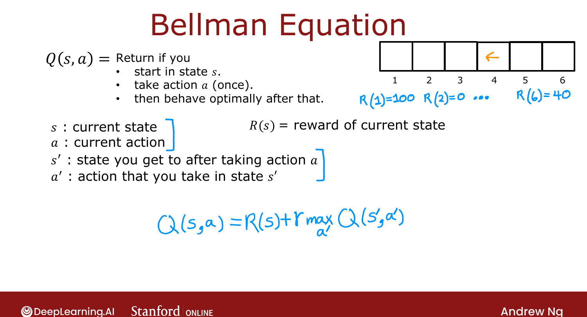
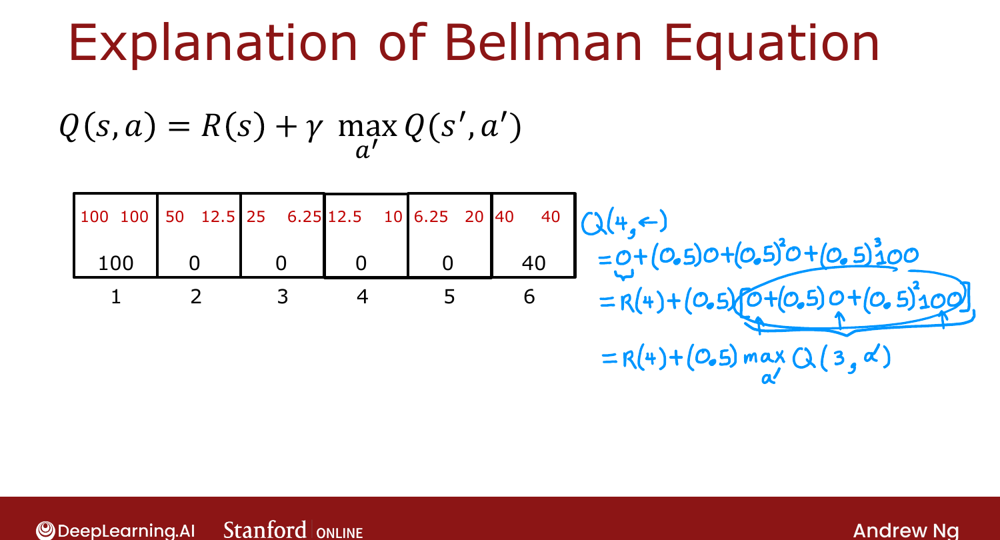

# Bellman Equation

> **Course 3 · Week 3** · _AI-generated study aid — not authoritative; trust the lecture & cited sources._

[← State-Action Value Function (Example)](../../course-3/week-3/state-action-value-function-example.md){ .md-button }

[Random (Stochastic) Environment →](../../course-3/week-3/random-stochastic-environment.md){ .md-button }

<video controls preload="none" playsinline src="https://dyckms5inbsqq.cloudfront.net/dlai/unsupervised-learning-recommenders-reinforcement-learning/W3/L8-MLS-C3W3L2S03-bellman-equation-L/lc-unsupervised-learning-recommenders-reinforcement-learning-W3-L8-MLS-C3W3L2S03-bellman-equation-L-master_360p.mp4?v=1752487441">Your browser can't play this video — <a href="https://dyckms5inbsqq.cloudfront.net/dlai/unsupervised-learning-recommenders-reinforcement-learning/W3/L8-MLS-C3W3L2S03-bellman-equation-L/lc-unsupervised-learning-recommenders-reinforcement-learning-W3-L8-MLS-C3W3L2S03-bellman-equation-L-master_360p.mp4?v=1752487441">download the lecture</a>.</video>

> 📄 **[Read the full lecture transcript](bellman-equation-transcript.md)**

If $Q(s,a)$ lets you pick good actions, how do you *compute* it? The **Bellman equation** —
the single most important equation in RL — gives the answer. `[00:02]`

## Notation

- $s$ = current state, $R(s)$ = its immediate reward, $a$ = current action.
- $s'$ = the state you reach after taking $a$; $a'$ = an action you might take in $s'$.

The "prime" marks the **next** state/action. `[00:33]`

## The equation

$$Q(s, a) = R(s) + \gamma \max_{a'} Q(s', a').$$

Two parts: the **immediate reward** $R(s)$ you get right away, plus $\gamma$ times the **best
possible return from the next state** $s'$ (behaving optimally thereafter). `[02:00]`

{ .slide }
_Official C3 slide — the Bellman equation (DeepLearning.AI / Stanford)._
{ .slide-cap }

## Worked example

$Q(2, \rightarrow)$: next state $s'=3$, so
$Q(2,\rightarrow) = R(2) + 0.5\max_{a'}Q(3, a') = 0 + 0.5\max(25, 6.25) = 0.5(25) = 12.5$ ✓.

$Q(4, \leftarrow)$: next state $s'=3$ again →
$0 + 0.5\max(25, 6.25) = 12.5$ ✓. `[02:43]`

In a **terminal state** there's no $s'$, so the second term vanishes and $Q(s,a) = R(s)$
(hence 100 and 40 at the ends). `[05:17]`

## The intuition

The total return splits into "reward now" + "discounted return from next state":

$$\underbrace{R_1 + \gamma R_2 + \gamma^2 R_3 + \cdots}_{\text{return from } s} \;=\; \underbrace{R_1}_{R(s)} + \gamma\underbrace{(R_2 + \gamma R_3 + \cdots)}_{\text{best return from } s'}.$$

Factoring out $\gamma$ shows the bracketed tail is exactly the optimal return starting from
$s'$, i.e. $\max_{a'}Q(s', a')$ — which is the equation. `[06:22]`

!!! note "Source: Sutton & Barto, *Reinforcement Learning* (Ch. 3–4)"
    This is the **Bellman optimality equation** for $Q^*$. Its recursive "immediate reward +
    discounted future value" decomposition underlies value iteration, Q-learning, and the
    deep-RL training target used later this week.

{ .slide }
_Official C3 slide — breaking the return into two parts (DeepLearning.AI / Stanford)._
{ .slide-cap }

Next (optional): what changes when the environment is **stochastic**. `[12:30]`

[← State-Action Value Function (Example)](../../course-3/week-3/state-action-value-function-example.md){ .md-button }

[Random (Stochastic) Environment →](../../course-3/week-3/random-stochastic-environment.md){ .md-button }

