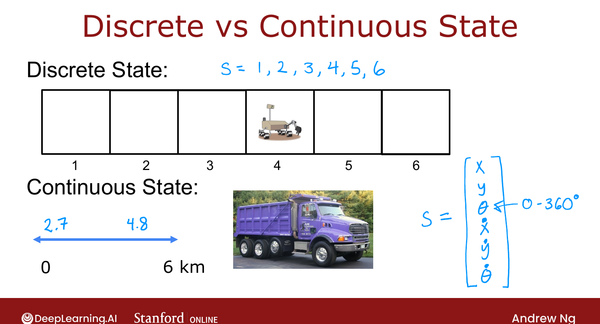
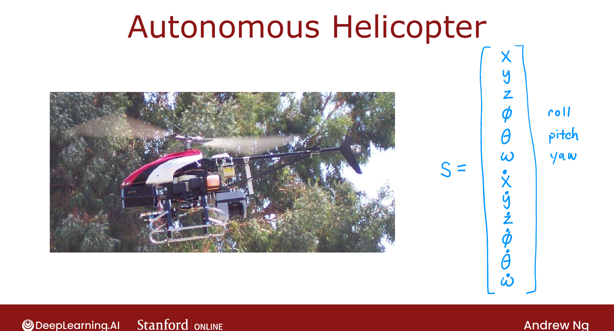

# Example of Continuous State-Space Applications

> **Course 3 · Week 3** · _AI-generated study aid — not authoritative; trust the lecture & cited sources._

[← Random (Stochastic) Environment](../../course-3/week-3/random-stochastic-environment.md){ .md-button }

[Lunar Lander →](../../course-3/week-3/lunar-lander.md){ .md-button }

<video controls preload="none" playsinline src="https://dyckms5inbsqq.cloudfront.net/dlai/unsupervised-learning-recommenders-reinforcement-learning/W3/L10-MLS-C3W3L3S01-example-of-continu/lc-unsupervised-learning-recommenders-reinforcement-learning-W3-L10-MLS-C3W3L3S01-example-of-continu-master_360p.mp4?v=1752487441">Your browser can't play this video — <a href="https://dyckms5inbsqq.cloudfront.net/dlai/unsupervised-learning-recommenders-reinforcement-learning/W3/L10-MLS-C3W3L3S01-example-of-continu/lc-unsupervised-learning-recommenders-reinforcement-learning-W3-L10-MLS-C3W3L3S01-example-of-continu-master_360p.mp4?v=1752487441">download the lecture</a>.</video>

> 📄 **[Read the full lecture transcript](example-of-continuous-state-space-applications-transcript.md)**

The Mars rover had a **discrete** state (one of 6 positions). Most real robots live in
**continuous** state spaces — the state is a **vector of real numbers**. `[00:02]`

## From discrete to continuous

If the rover could be **anywhere** on a 0–6 km line (2.7 km, 4.8 km, …), that's a continuous
state — a single real number rather than one of six labels. `[00:18]`

## A car/truck: 6 numbers

To control a self-driving truck smoothly, the state is: `[01:18]`

$$s = \big[\,x,\; y,\; \theta,\; \dot{x},\; \dot{y},\; \dot{\theta}\,\big]$$

position $x, y$, orientation $\theta$, and the three rates of change (velocities) $\dot x,
\dot y, \dot\theta$. Each can take any value in its range (e.g. $\theta \in [0, 360°)$).

{ .slide }
_Official C3 slide — discrete vs. continuous state (DeepLearning.AI / Stanford)._
{ .slide-cap }

## A helicopter: 12 numbers

An autonomous helicopter's state stacks position, orientation, and all their rates: `[03:25]`

$$s = \big[\,x, y, z,\; \phi, \theta, \omega,\; \dot{x}, \dot{y}, \dot{z},\; \dot{\phi}, \dot{\theta}, \dot{\omega}\,\big]$$

— north/south, east/west, height; **roll** $\phi$, **pitch** $\theta$, **yaw** $\omega$; and
the six corresponding velocities/angular velocities. The policy reads these 12 numbers and
outputs an action. `[05:21]`

So a **continuous-state MDP** simply replaces the small discrete state with a real-valued
vector. Next: the week's lab application — the **lunar lander**. `[06:03]`

{ .slide }
_Official C3 slide — the helicopter's 12-number state (DeepLearning.AI / Stanford)._
{ .slide-cap }

[← Random (Stochastic) Environment](../../course-3/week-3/random-stochastic-environment.md){ .md-button }

[Lunar Lander →](../../course-3/week-3/lunar-lander.md){ .md-button }

