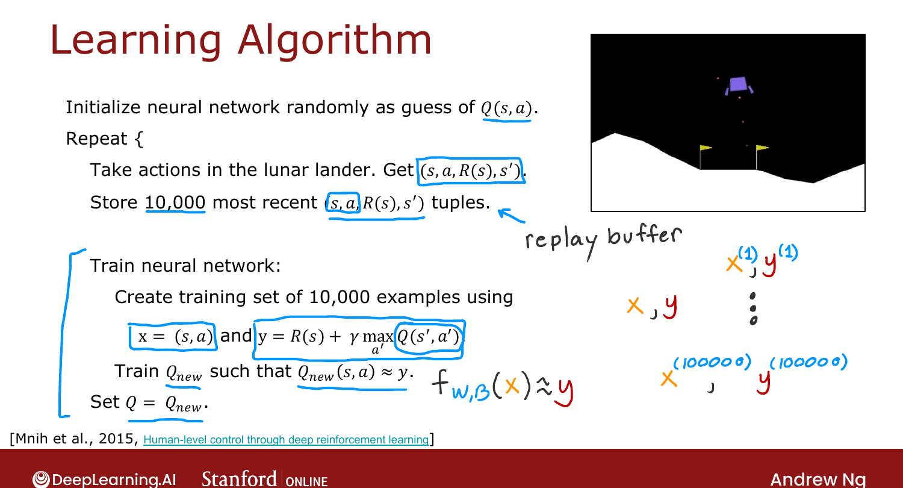
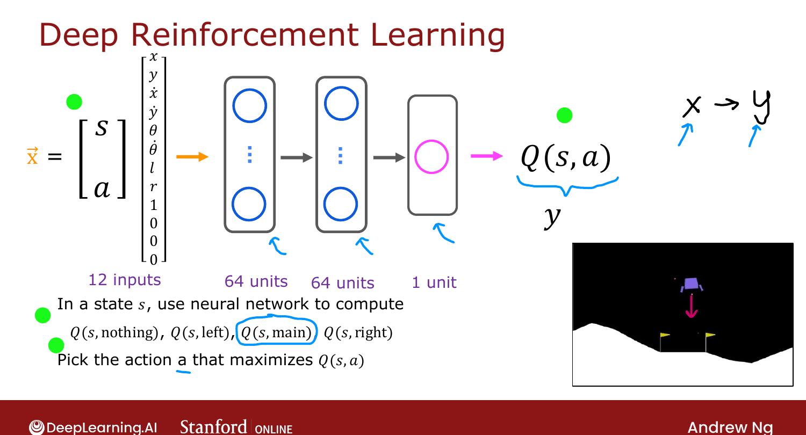

# Learning the State-Value Function

> **Course 3 · Week 3** · _AI-generated study aid — not authoritative; trust the lecture & cited sources._

[← Lunar Lander](../../course-3/week-3/lunar-lander.md){ .md-button }

[Algorithm Refinement: Improved Neural Network Architecture →](../../course-3/week-3/algorithm-refinement-improved-neural-network-architecture.md){ .md-button }

<video controls preload="none" playsinline src="https://dyckms5inbsqq.cloudfront.net/dlai/unsupervised-learning-recommenders-reinforcement-learning/W3/L12-MLS-C3W3L3S03-learning-the-state/lc-unsupervised-learning-recommenders-reinforcement-learning-W3-L12-MLS-C3W3L3S03-learning-the-state-master_360p.mp4?v=1752487442">Your browser can't play this video — <a href="https://dyckms5inbsqq.cloudfront.net/dlai/unsupervised-learning-recommenders-reinforcement-learning/W3/L12-MLS-C3W3L3S03-learning-the-state/lc-unsupervised-learning-recommenders-reinforcement-learning-W3-L12-MLS-C3W3L3S03-learning-the-state-master_360p.mp4?v=1752487442">download the lecture</a>.</video>

> 📄 **[Read the full lecture transcript](learning-the-state-value-function-transcript.md)**

The core deep-RL idea: **train a neural network to approximate $Q(s,a)$**, then pick actions
by maximizing it. This is the **DQN (Deep Q-Network)** algorithm. `[00:02]`

## The network

Input $x$ = state + action: the lunar lander's **8** state numbers plus a **one-hot** encoding
of the action (4 numbers) = **12 inputs**. Two hidden layers of 64 units → **1 output** =
$Q(s,a)$ (the "target" $y$). In each state, run it for all 4 actions and pick the one with the
largest $Q$. `[00:24]`

{ .slide }
_Official C3 slide — learning the Q-function with a neural network (DeepLearning.AI / Stanford)._
{ .slide-cap }

{ .slide }
_Official C3 slide — the Q-network (DeepLearning.AI / Stanford)._
{ .slide-cap }
## Building a training set with Bellman

This is supervised learning where the **targets come from the Bellman equation**. Fly the
lander (taking random actions early), recording **tuples** $(s, a, R(s), s')$. Each tuple
becomes one training example: `[03:48]`

$$x = (s, a), \qquad y = R(s) + \gamma \max_{a'} Q(s', a').$$

The first two tuple elements give $x$; the last two compute $y$. The $Q$ on the right comes
from the **current network** — initially a random guess, but it improves. `[09:18]`

## The full algorithm

1. **Initialize** the network randomly (a random guess at $Q$). `[10:09]`
2. **Repeat:**
   - Take actions in the lander; store the **10,000 most recent** $(s,a,R(s),s')$ tuples — the
     **replay buffer** (caps memory). `[12:06]`
   - Build 10,000 training examples $(x, y)$ with $y$ from Bellman (using the current $Q$).
   - Train a new network $Q_{\text{new}}$ to predict $y$ from $x$ with **mean-squared-error**
     loss.
   - **Set $Q = Q_{\text{new}}$** — now a slightly better estimate.

Iterating, $\max_{a'}Q(s',a')$ keeps improving, so the targets improve, so $Q$ converges
toward the true value function. `[14:00]`

!!! note "Source: Mnih et al. 2015, *Human-level control through deep RL* (Nature)"
    Ng credits "Mnih et al." — the **DQN** paper that learned to play Atari from pixels. Its
    two signature tricks, the **replay buffer** and bootstrapped Bellman targets, are exactly
    what's used here.

It "sort of works" as described — the next videos add refinements that make it work **much**
better. `[16:09]`

[← Lunar Lander](../../course-3/week-3/lunar-lander.md){ .md-button }

[Algorithm Refinement: Improved Neural Network Architecture →](../../course-3/week-3/algorithm-refinement-improved-neural-network-architecture.md){ .md-button }

