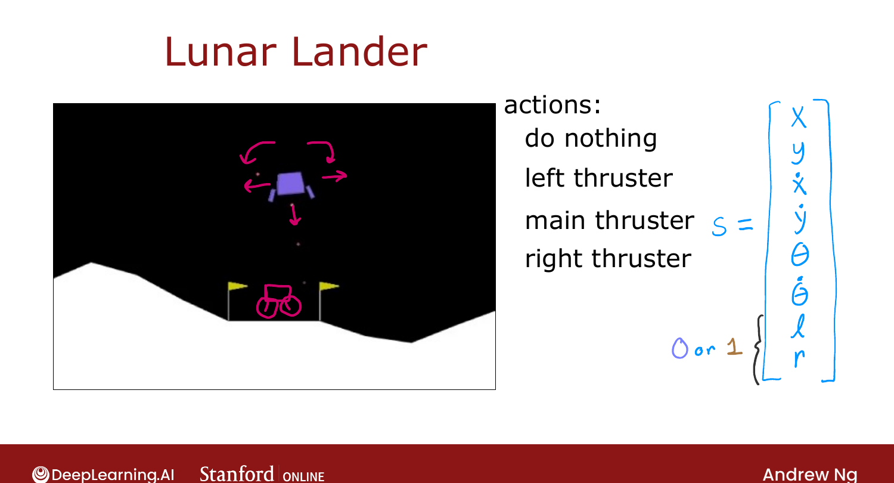
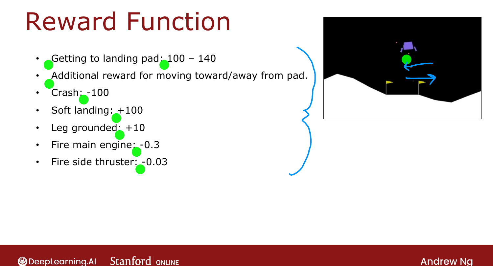

# Lunar Lander

> **Course 3 · Week 3** · _AI-generated study aid — not authoritative; trust the lecture & cited sources._

[← Example of Continuous State-Space Applications](../../course-3/week-3/example-of-continuous-state-space-applications.md){ .md-button }

[Learning the State-Value Function →](../../course-3/week-3/learning-the-state-value-function.md){ .md-button }

<video controls preload="none" playsinline src="https://dyckms5inbsqq.cloudfront.net/dlai/unsupervised-learning-recommenders-reinforcement-learning/W3/L11-MLS-C3W3L3S02---v5-L11/lc-unsupervised-learning-recommenders-reinforcement-learning-W3-L11-MLS-C3W3L3S02---v5-L11-master_360p.mp4?v=1752487442">Your browser can't play this video — <a href="https://dyckms5inbsqq.cloudfront.net/dlai/unsupervised-learning-recommenders-reinforcement-learning/W3/L11-MLS-C3W3L3S02---v5-L11/lc-unsupervised-learning-recommenders-reinforcement-learning-W3-L11-MLS-C3W3L3S02---v5-L11-master_360p.mp4?v=1752487442">download the lecture</a>.</video>

> 📄 **[Read the full lecture transcript](lunar-lander-transcript.md)**

The week's practice application: land a simulated vehicle on the moon — a classic RL
benchmark and a **continuous-state** problem. `[00:02]`

## Actions (4)

Each time step, pick one of: `[00:51]`

- **nothing** — gravity/inertia pull it down,
- **left** — fire the left thruster (pushes it *right*),
- **main** — fire the main downward engine,
- **right** — fire the right thruster (pushes it *left*).

{ .slide }
_Official C3 slide — lunar lander actions and state (DeepLearning.AI / Stanford)._
{ .slide-cap }

## State (8 numbers)

$$s = \big[\,x,\; y,\; \dot{x},\; \dot{y},\; \theta,\; \dot{\theta},\; l,\; r\,\big]$$

position $x, y$; velocities $\dot x, \dot y$; tilt angle $\theta$ and its rate $\dot\theta$;
plus two **binary** flags $l, r$ for whether the **left/right leg** is touching the ground
(small positioning differences matter a lot for landing). `[02:02]`

## A carefully designed reward function

| Event | Reward |
|---|---|
| Getting to the landing pad | +100 to +140 (better-centered → higher) |
| Moving toward / away from pad | + / − |
| Crash | −100 |
| Soft (non-crash) landing | +100 |
| Each leg grounded | +10 |
| Firing main engine (per step) | −0.3 |
| Firing a side thruster (per step) | −0.03 |

This is a **moderately complex** reward — the designers thought carefully about what behavior
to incentivize (and the small fuel penalties discourage wasteful thrusting). Still, specifying
the *reward* is far easier than specifying the *right action* from every state. `[03:09]`

{ .slide }
_Official C3 slide — the lander's reward function (DeepLearning.AI / Stanford)._
{ .slide-cap }
## Goal

Learn a policy $\pi(s) = a$ maximizing the return, with a large discount $\gamma = 0.985$.

!!! note "Source: Sutton & Barto, *Reinforcement Learning* (Ch. 17, reward design)"
    The lander's hand-shaped reward (terminal bonuses + shaping terms + fuel penalties) is a
    textbook case of **reward shaping** — Sutton & Barto caution that small reward-design
    choices strongly steer the learned policy, exactly as Ng notes here.

Next: a deep-learning algorithm (a neural network estimating $Q$) to actually solve it. `[04:54]`

[← Example of Continuous State-Space Applications](../../course-3/week-3/example-of-continuous-state-space-applications.md){ .md-button }

[Learning the State-Value Function →](../../course-3/week-3/learning-the-state-value-function.md){ .md-button }

