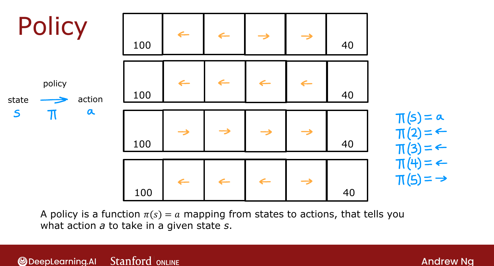
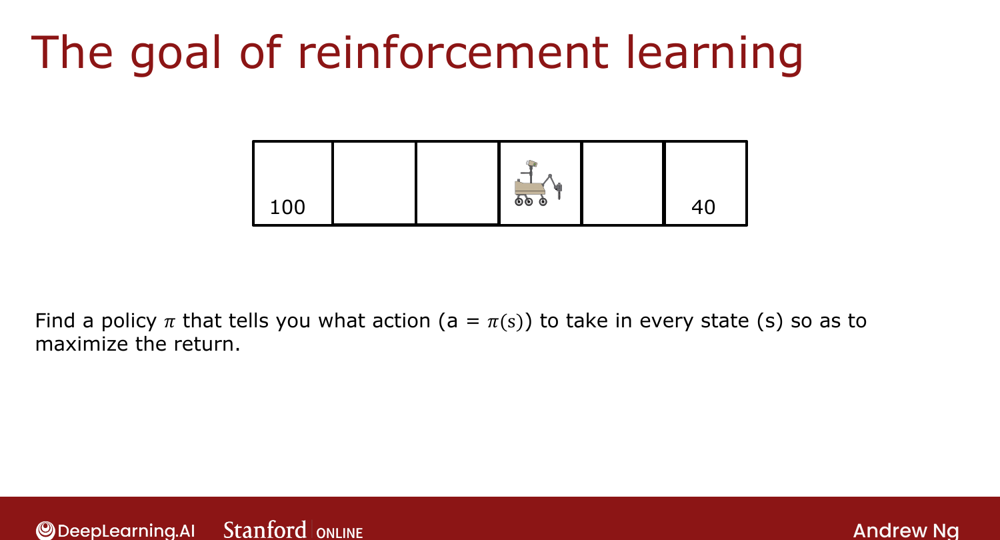

# Making Decisions: Policies in Reinforcement Learning

> **Course 3 · Week 3** · _AI-generated study aid — not authoritative; trust the lecture & cited sources._

[← The Return in Reinforcement Learning](../../course-3/week-3/the-return-in-reinforcement-learning.md){ .md-button }

[Review of Key Concepts →](../../course-3/week-3/review-of-key-concepts.md){ .md-button }

<video controls preload="none" playsinline src="https://dyckms5inbsqq.cloudfront.net/dlai/unsupervised-learning-recommenders-reinforcement-learning/W3/L4-MLS-C3W3L1S04-making-decisions_-/lc-unsupervised-learning-recommenders-reinforcement-learning-W3-L4-MLS-C3W3L1S04-making-decisions_--master_360p.mp4?v=1752487440">Your browser can't play this video — <a href="https://dyckms5inbsqq.cloudfront.net/dlai/unsupervised-learning-recommenders-reinforcement-learning/W3/L4-MLS-C3W3L1S04-making-decisions_-/lc-unsupervised-learning-recommenders-reinforcement-learning-W3-L4-MLS-C3W3L1S04-making-decisions_--master_360p.mp4?v=1752487440">download the lecture</a>.</video>

> 📄 **[Read the full lecture transcript](making-decisions-policies-in-reinforcement-learning-transcript.md)**

A short lesson that names the central object RL is trying to find: the **policy**. `[00:02]`

## What a policy is

There are many ways to choose actions — always go for the nearer reward, always the larger
reward, always the smaller (bad idea, but valid), or "go left unless you're one step from the
lesser reward." A **policy $\pi$** is a function that, for **any state $s$**, outputs the
**action $a$** to take: $\pi(s) = a$. `[00:55]`

{ .slide }
_Official C3 slide — a policy maps states to actions (DeepLearning.AI / Stanford)._
{ .slide-cap }

## The goal of RL

> Find a policy $\pi$ that tells you what action $a = \pi(s)$ to take in every state $s$ so as
> to **maximize the return**.

Ng notes "policy" isn't the most descriptive name — "**controller**" would arguably fit
better — but "policy" is the standard RL term. `[01:57]`

{ .slide }
_Official C3 slide — the goal of RL (DeepLearning.AI / Stanford)._
{ .slide-cap }

Next: a quick **review** of all the concepts so far (states, actions, rewards, return,
policy) and how they generalize beyond the Mars rover. `[02:19]`

[← The Return in Reinforcement Learning](../../course-3/week-3/the-return-in-reinforcement-learning.md){ .md-button }

[Review of Key Concepts →](../../course-3/week-3/review-of-key-concepts.md){ .md-button }

