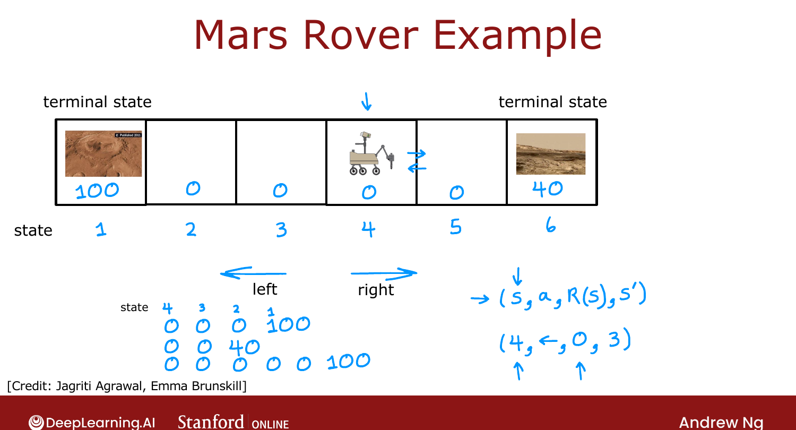

# Mars Rover Example

> **Course 3 · Week 3** · _AI-generated study aid — not authoritative; trust the lecture & cited sources._

[← What is Reinforcement Learning?](../../course-3/week-3/what-is-reinforcement-learning.md){ .md-button }

[The Return in Reinforcement Learning →](../../course-3/week-3/the-return-in-reinforcement-learning.md){ .md-button }

<video controls preload="none" playsinline src="https://dyckms5inbsqq.cloudfront.net/dlai/unsupervised-learning-recommenders-reinforcement-learning/W3/L2-MLS-C3W3L1S02-mars-rover-example/lc-unsupervised-learning-recommenders-reinforcement-learning-W3-L2-MLS-C3W3L1S02-mars-rover-example-master_360p.mp4?v=1752487440">Your browser can't play this video — <a href="https://dyckms5inbsqq.cloudfront.net/dlai/unsupervised-learning-recommenders-reinforcement-learning/W3/L2-MLS-C3W3L1S02-mars-rover-example/lc-unsupervised-learning-recommenders-reinforcement-learning-W3-L2-MLS-C3W3L1S02-mars-rover-example-master_360p.mp4?v=1752487440">download the lecture</a>.</video>

> 📄 **[Read the full lecture transcript](mars-rover-example-transcript.md)**

To formalize RL without the complexity of a helicopter, Ng uses a simplified **Mars rover**
on a line of **six positions** (states 1–6). `[00:02]`

## States, rewards, terminal states

The rover's position is its **state** $s$. State 1 (left) has the most scientifically
interesting rock — **reward 100**; state 6 (right) is interesting too but less so — **reward
40**; states 2–5 give **reward 0**. The rover starts in state 4. States 1 and 6 are
**terminal states**: once reached, the rover collects that reward and the day ends — no
further rewards. `[00:34]`

{ .slide }
_Official C3 slide — the Mars rover setup (DeepLearning.AI / Stanford)._
{ .slide-cap }

## Actions

At each step the rover chooses one of two **actions**: go **left** or go **right**. From
state 4, going left reaches state 1 (reward 100) after passing through 0-reward states;
going right reaches state 6 (reward 40). It could even dither — right then left — wasting
time before reaching a reward. `[02:36]`

## The core tuple: (s, a, R(s), s′)

Every step, the rover is in state $s$, takes action $a$, receives the reward $R(s)$ of its
**current** state, and lands in a new state $s'$. E.g. in state 4, action "left": reward
$R(4) = 0$, next state $s' = 3$. These four things — **state, action, reward, next state** —
are the core element every RL algorithm looks at. `[05:07]`

!!! warning "$R(s)$ is the reward of the state you're leaving"
    The reward $R(s)$ is associated with the **current** state $s$, not the next state $s'$.
    So leaving state 4 gives $R(4)=0$ — the 100 only arrives when the rover is *in* state 1.

Next: how to compare different sequences of rewards — the **return**. `[06:26]`

[← What is Reinforcement Learning?](../../course-3/week-3/what-is-reinforcement-learning.md){ .md-button }

[The Return in Reinforcement Learning →](../../course-3/week-3/the-return-in-reinforcement-learning.md){ .md-button }

