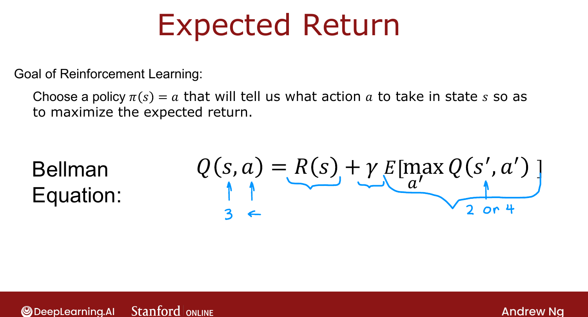
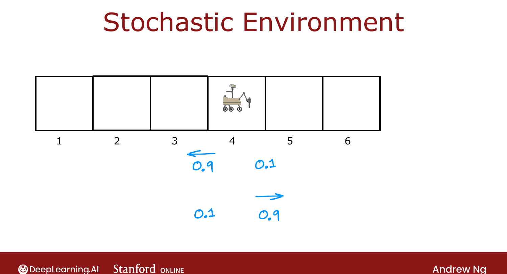

# Random (Stochastic) Environment

> **Course 3 · Week 3** · _AI-generated study aid — not authoritative; trust the lecture & cited sources._

[← Bellman Equation](../../course-3/week-3/bellman-equation.md){ .md-button }

[Example of Continuous State-Space Applications →](../../course-3/week-3/example-of-continuous-state-space-applications.md){ .md-button }

<video controls preload="none" playsinline src="https://dyckms5inbsqq.cloudfront.net/dlai/unsupervised-learning-recommenders-reinforcement-learning/W3/L9-MLS-C3W3L2S04-random-stochastic-/lc-unsupervised-learning-recommenders-reinforcement-learning-W3-L9-MLS-C3W3L2S04-random-stochastic--master_360p.mp4?v=1752487441">Your browser can't play this video — <a href="https://dyckms5inbsqq.cloudfront.net/dlai/unsupervised-learning-recommenders-reinforcement-learning/W3/L9-MLS-C3W3L2S04-random-stochastic-/lc-unsupervised-learning-recommenders-reinforcement-learning-W3-L9-MLS-C3W3L2S04-random-stochastic--master_360p.mp4?v=1752487441">download the lecture</a>.</video>

> 📄 **[Read the full lecture transcript](random-stochastic-environment-transcript.md)**

_(Optional.)_ Real robots don't always do what you command — wheels slip, wind blows them off
course. This generalizes RL to **stochastic** environments. `[00:02]`

## Misstep probability

Suppose commanding "left" works 90% of the time but 10% of the time the rover slips and goes
**right** (and vice versa). Now following a fixed policy from state 4 produces a **random**
sequence of states/rewards — maybe $0,0,0,100$ if lucky; maybe $0,0,0,0,100$ if it slips back;
maybe $0,0,40$ if it slips the wrong way entirely. `[00:42]`

{ .slide }
_Official C3 slide — expected return in a stochastic MDP (DeepLearning.AI / Stanford)._
{ .slide-cap }

{ .slide }
_Official C3 slide — a stochastic environment (DeepLearning.AI / Stanford)._
{ .slide-cap }
## Maximize the EXPECTED return

Since the return is now a random number, we don't maximize *the* return — we maximize its
**average over many runs**, the **expected return**: `[03:46]`

$$\text{maximize}\quad \mathbb{E}\big[R_1 + \gamma R_2 + \gamma^2 R_3 + \cdots\big].$$

("Expected" is just statistics-speak for "average.") The goal: pick the policy $\pi$ that
maximizes the expected sum of discounted rewards. `[05:07]`

## Bellman equation, with an expectation

Because the next state $s'$ is now random, the Bellman equation gains an **expectation** over
$s'$: `[05:22]`

$$Q(s, a) = R(s) + \gamma\, \mathbb{E}\!\left[\max_{a'} Q(s', a')\right].$$

In the optional lab, raising the **misstep probability** lowers the Q-values and the optimal
returns — more randomness means less control, so every state is worth less (e.g. at 40%
misstep the rover only obeys 60% of the time, and values drop further). `[06:17]`

Next: scaling beyond 6 discrete states to **continuous** state spaces. `[07:52]`

[← Bellman Equation](../../course-3/week-3/bellman-equation.md){ .md-button }

[Example of Continuous State-Space Applications →](../../course-3/week-3/example-of-continuous-state-space-applications.md){ .md-button }

