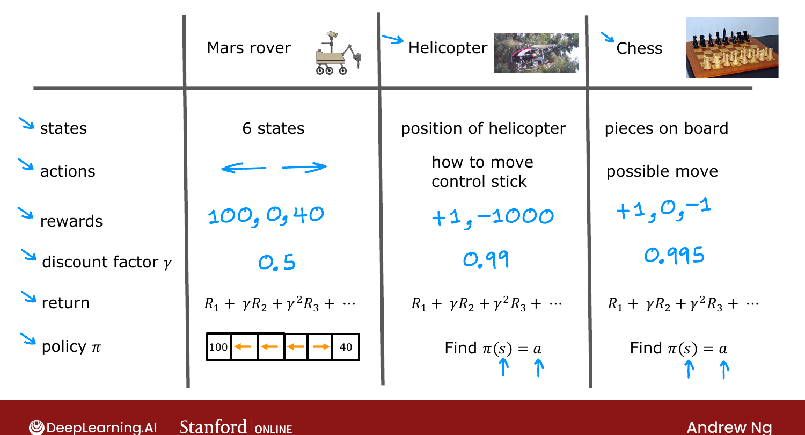
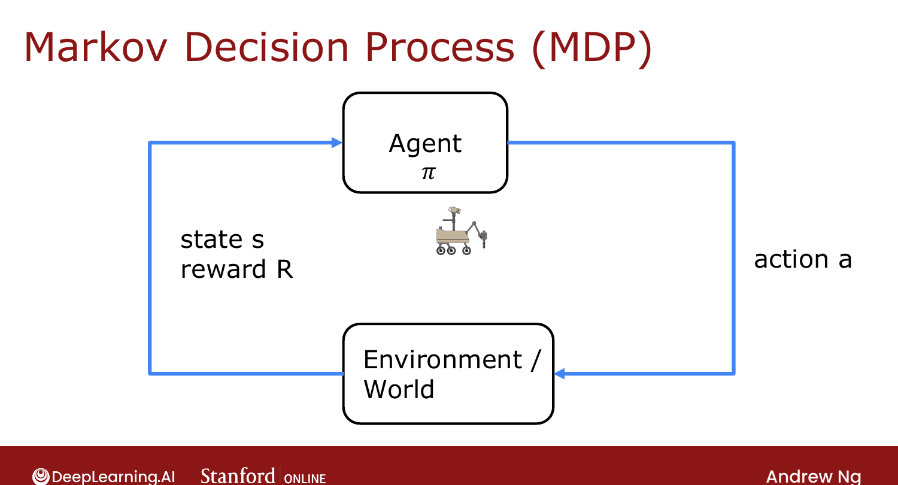

# Review of Key Concepts

> **Course 3 · Week 3** · _AI-generated study aid — not authoritative; trust the lecture & cited sources._

[← Making Decisions: Policies in Reinforcement Learning](../../course-3/week-3/making-decisions-policies-in-reinforcement-learning.md){ .md-button }

[State-Action Value Function (Definition) →](../../course-3/week-3/state-action-value-function-definition.md){ .md-button }

<video controls preload="none" playsinline src="https://dyckms5inbsqq.cloudfront.net/dlai/unsupervised-learning-recommenders-reinforcement-learning/W3/L5-MLS-C3W3L1S05-review-of-key-conc/lc-unsupervised-learning-recommenders-reinforcement-learning-W3-L5-MLS-C3W3L1S05-review-of-key-conc-master_360p.mp4?v=1752487440">Your browser can't play this video — <a href="https://dyckms5inbsqq.cloudfront.net/dlai/unsupervised-learning-recommenders-reinforcement-learning/W3/L5-MLS-C3W3L1S05-review-of-key-conc/lc-unsupervised-learning-recommenders-reinforcement-learning-W3-L5-MLS-C3W3L1S05-review-of-key-conc-master_360p.mp4?v=1752487440">download the lecture</a>.</video>

> 📄 **[Read the full lecture transcript](review-of-key-concepts-transcript.md)**

A consolidation of the RL formalism — **states, actions, rewards, discount factor, return,
policy** — and how the *same* framework describes very different problems. `[00:02]`

## The same five pieces, three problems

| | Mars rover | Autonomous helicopter | Chess |
|---|---|---|---|
| **States** $s$ | 6 positions | position/orientation/speed | board position |
| **Actions** $a$ | left / right | control-stick movements | legal moves |
| **Rewards** $R(s)$ | 100 / 40 / 0 | +1 flying well, −1000 crash | +1 win, −1 lose, 0 draw |
| **Discount** $\gamma$ | 0.5 | ~0.99 | ~0.99–0.999 |
| **Return** | $R_1 + \gamma R_2 + \cdots$ | same formula | same formula |
| **Policy** $\pi(s)$ | which way to move | how to move sticks | which move to play |

In every case the goal is identical: find $\pi(s)$ that maximizes the return. `[01:07]`

{ .slide }
_Official C3 slide — the RL formalism across problems (DeepLearning.AI / Stanford)._
{ .slide-cap }
## Markov Decision Process (MDP)

This whole formalism has a name: a **Markov Decision Process (MDP)**. "Markov" means the
**future depends only on the current state**, not on how you got there. `[03:17]`

{ .slide }
_Official C3 slide — the agent–environment MDP loop (DeepLearning.AI / Stanford)._
{ .slide-cap }

One common picture: an **agent** chooses actions $a$ via policy $\pi$; the **environment/world**
responds; the agent then **observes** the new state $s$ and reward $R$ — and the loop
repeats. `[04:02]`

!!! note "Source: Sutton & Barto, *Reinforcement Learning* (Ch. 3, Finite MDPs)"
    The agent–environment interface diagram and the **Markov property** ("the future is
    independent of the past given the present") are the formal backbone of RL in Sutton &
    Barto; Ng's MDP slide is the same construction.

Next: the **state-action value function** $Q(s,a)$ — the key quantity for actually learning a
good policy. `[05:06]`

[← Making Decisions: Policies in Reinforcement Learning](../../course-3/week-3/making-decisions-policies-in-reinforcement-learning.md){ .md-button }

[State-Action Value Function (Definition) →](../../course-3/week-3/state-action-value-function-definition.md){ .md-button }

