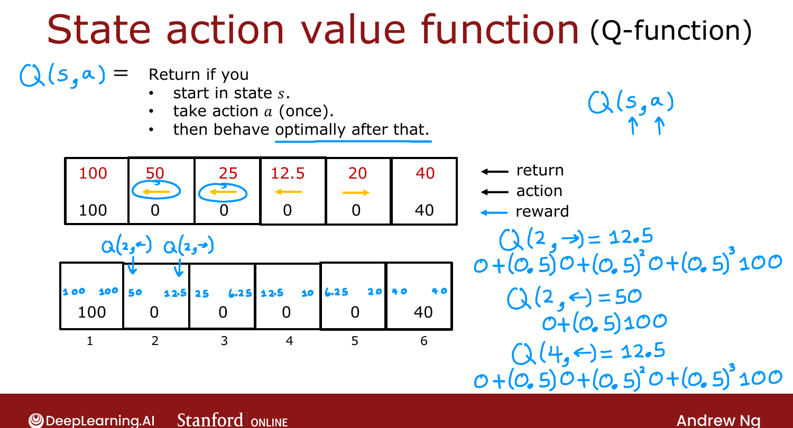

# State-Action Value Function (Definition)

> **Course 3 · Week 3** · _AI-generated study aid — not authoritative; trust the lecture & cited sources._

[← Review of Key Concepts](../../course-3/week-3/review-of-key-concepts.md){ .md-button }

[State-Action Value Function (Example) →](../../course-3/week-3/state-action-value-function-example.md){ .md-button }

<video controls preload="none" playsinline src="https://dyckms5inbsqq.cloudfront.net/dlai/unsupervised-learning-recommenders-reinforcement-learning/W3/L6-MLS-C3W3L2S01-state-action-value/lc-unsupervised-learning-recommenders-reinforcement-learning-W3-L6-MLS-C3W3L2S01-state-action-value-master_360p.mp4?v=1752487440">Your browser can't play this video — <a href="https://dyckms5inbsqq.cloudfront.net/dlai/unsupervised-learning-recommenders-reinforcement-learning/W3/L6-MLS-C3W3L2S01-state-action-value/lc-unsupervised-learning-recommenders-reinforcement-learning-W3-L6-MLS-C3W3L2S01-state-action-value-master_360p.mp4?v=1752487440">download the lecture</a>.</video>

> 📄 **[Read the full lecture transcript](state-action-value-function-definition-transcript.md)**

The key quantity RL algorithms compute is the **state-action value function**, written
$Q(s, a)$ — often just the **Q-function**. `[00:02]`

## Definition

$$Q(s, a) = \text{the return if you start in state } s,\ \text{take action } a \text{ once},\ \text{then behave \textbf{optimally} afterward.}$$

There's a deliberate **circularity** here — it refers to "behaving optimally" before we know
the optimal policy. Ng flags it and promises later algorithms resolve it (you can compute $Q$
*before* having the optimal policy). For now, take it on faith. `[00:32]`

## Worked example (Mars rover, γ = 0.5)

Using the optimal policy (left from states 2–4, right from state 5): `[01:41]`

- $Q(2, \rightarrow)$: go right to state 3, then optimally left-left to the 100. Rewards
  $0,0,0,100$ → return $0.5^3 \times 100 = 12.5$. (It faithfully reports the return even though
  right is a *bad* move from state 2.)
- $Q(2, \leftarrow)$: rewards $0, 100$ → $0.5 \times 100 = 50$.
- $Q(4, \leftarrow)$: rewards $0,0,0,100$ → $12.5$.

{ .slide }
_Official C3 slide — defining the Q-function (DeepLearning.AI / Stanford)._
{ .slide-cap }

## Why Q lets you pick actions

The **best possible return** from a state is $\max_a Q(s, a)$, and the **best action** is the
$a$ that achieves it: `[06:11]`

$$\pi(s) = \arg\max_a Q(s, a), \qquad \text{best return} = \max_a Q(s, a).$$

E.g. in state 4, $Q(4,\leftarrow)=12.5 > Q(4,\rightarrow)=10$, so go left. So **if you can
compute $Q(s,a)$ for every state-action pair, you can read off the optimal policy** — just
pick the maximizing action everywhere. That's why computing $Q$ is central. `[08:02]`

!!! note "Notation: Q* / the optimal Q-function"
    In the RL literature you'll see this written $Q^*(s,a)$ and called the **optimal**
    Q-function. It means exactly the $Q$ defined here — don't let the star confuse you. `[09:25]`

Next: concrete examples of how $Q$ values shift with the rewards and $\gamma$. `[10:29]`

[← Review of Key Concepts](../../course-3/week-3/review-of-key-concepts.md){ .md-button }

[State-Action Value Function (Example) →](../../course-3/week-3/state-action-value-function-example.md){ .md-button }

