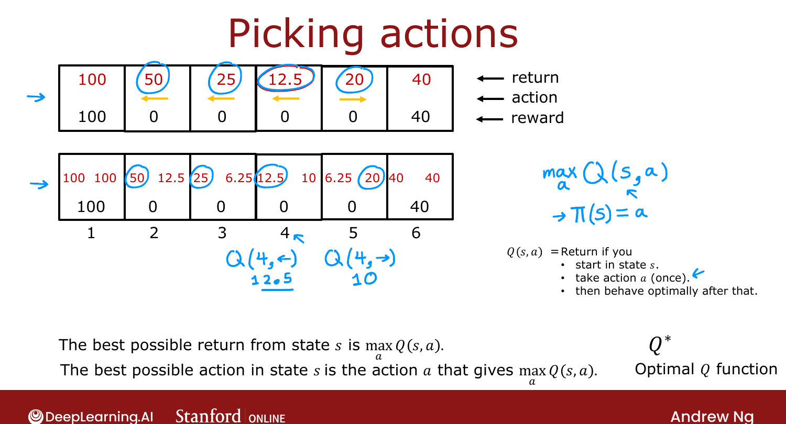

# State-Action Value Function (Example)

> **Course 3 · Week 3** · _AI-generated study aid — not authoritative; trust the lecture & cited sources._

[← State-Action Value Function (Definition)](../../course-3/week-3/state-action-value-function-definition.md){ .md-button }

[Bellman Equation →](../../course-3/week-3/bellman-equation.md){ .md-button }

<video controls preload="none" playsinline src="https://dyckms5inbsqq.cloudfront.net/dlai/unsupervised-learning-recommenders-reinforcement-learning/W3/L7-MLS-C3W3L2S02-state-action-value/lc-unsupervised-learning-recommenders-reinforcement-learning-W3-L7-MLS-C3W3L2S02-state-action-value-master_360p.mp4?v=1752487441">Your browser can't play this video — <a href="https://dyckms5inbsqq.cloudfront.net/dlai/unsupervised-learning-recommenders-reinforcement-learning/W3/L7-MLS-C3W3L2S02-state-action-value/lc-unsupervised-learning-recommenders-reinforcement-learning-W3-L7-MLS-C3W3L2S02-state-action-value-master_360p.mp4?v=1752487441">download the lecture</a>.</video>

> 📄 **[Read the full lecture transcript](state-action-value-function-example-transcript.md)**

An **optional lab** lets you modify the Mars rover and watch $Q(s,a)$, the optimal return,
and the optimal policy change. This lesson walks through that intuition. `[00:02]`

## What you can change

The notebook fixes 6 states and 2 actions, and exposes the **terminal rewards**, the
**discount factor $\gamma$**, and a **misstep probability** (covered in a later video). Running
it computes and visualizes the optimal policy and the Q-function. `[00:27]`

## What the experiments show

- **Shrink the right reward (40 → 10):** even in state 5 (right next to it), going *left* now
  yields more ($6.25 > 5$), so the optimal policy becomes **go left from every state**. `[01:33]`
- **Raise $\gamma$ (0.5 → 0.9):** the rover gets **more patient** — future rewards are
  discounted less — so from state 5 it now prefers the far 100 ($65.61 > 36$). `[02:19]`
- **Drop $\gamma$ (→ 0.3):** **very impatient** — from state 4 it no longer holds out for the
  100; it grabs the nearer 40. `[03:00]`

!!! tip "The lesson lives in the optional notebook"
    There's no new equation here — the point is hands-on intuition for how rewards and
    $\gamma$ reshape $Q$, the optimal return ($\max_a Q$), and the policy. Ng strongly
    encourages playing with the lab before the next topic.

{ .slide }
_Official C3 slide — picking actions from Q values (DeepLearning.AI / Stanford)._
{ .slide-cap }

Next: the single most important equation in RL — the **Bellman equation** — which is how you
actually *compute* $Q$. `[05:02]`

[← State-Action Value Function (Definition)](../../course-3/week-3/state-action-value-function-definition.md){ .md-button }

[Bellman Equation →](../../course-3/week-3/bellman-equation.md){ .md-button }

