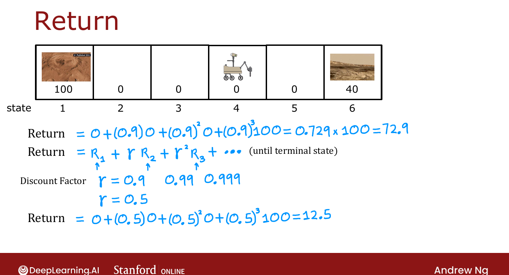

# The Return in Reinforcement Learning

> **Course 3 · Week 3** · _AI-generated study aid — not authoritative; trust the lecture & cited sources._

[← Mars Rover Example](../../course-3/week-3/mars-rover-example.md){ .md-button }

[Making Decisions: Policies in Reinforcement Learning →](../../course-3/week-3/making-decisions-policies-in-reinforcement-learning.md){ .md-button }

<video controls preload="none" playsinline src="https://dyckms5inbsqq.cloudfront.net/dlai/unsupervised-learning-recommenders-reinforcement-learning/W3/L3-MLS-C3W3L1S03-the-return-in-rein/lc-unsupervised-learning-recommenders-reinforcement-learning-W3-L3-MLS-C3W3L1S03-the-return-in-rein-master_360p.mp4?v=1752487440">Your browser can't play this video — <a href="https://dyckms5inbsqq.cloudfront.net/dlai/unsupervised-learning-recommenders-reinforcement-learning/W3/L3-MLS-C3W3L1S03-the-return-in-rein/lc-unsupervised-learning-recommenders-reinforcement-learning-W3-L3-MLS-C3W3L1S03-the-return-in-rein-master_360p.mp4?v=1752487440">download the lecture</a>.</video>

> 📄 **[Read the full lecture transcript](the-return-in-reinforcement-learning-transcript.md)**

How do you tell whether one set of rewards is better than another? The **return** captures
that — and encodes the idea that rewards you get **sooner** are worth more. `[00:02]`

## The $5-now vs. $10-later intuition

A \$5 bill at your feet vs. a \$10 bill a half-hour walk away: \$10 is more, but if it takes
ages to reach, the nearer \$5 may be the better deal. The return formalizes this with a
**discount factor** $\gamma$ (a number slightly less than 1). `[00:26]`

## Definition

If the rewards along a path are $R_1, R_2, R_3, \dots$, the **return** is: `[01:35]`

$$G = R_1 + \gamma R_2 + \gamma^2 R_3 + \gamma^3 R_4 + \cdots$$

Full credit goes to the first reward; each later reward is discounted by a higher power of
$\gamma$, making the algorithm a bit **impatient** — sooner is better. Common real choices are
$\gamma = 0.9, 0.99, 0.999$; for easy arithmetic, this example uses $\gamma = 0.5$. `[02:48]`

With $\gamma = 0.5$, starting in state 4 and always going left:
$0 + 0.5(0) + 0.5^2(0) + 0.5^3(100) = 12.5$. `[04:00]`

{ .slide }
_Official C3 slide — computing the return (DeepLearning.AI / Stanford)._
{ .slide-cap }

## Return depends on actions

Rewards depend on actions, so the return does too. **Always-left** gives returns
$100, 50, 25, 12.5, 6.25, 40$ across states 1–6; **always-right** gives lower returns for
most states ($10, 20, 5, 2.5, \dots, 140$). A **mixed** policy — go left from states 2–4 but
right from state 5 (it's close to the 40) — yields $100, 50, 25, 12.5, 20, 40$. So the best
action depends on the state. `[04:59]`

## Discounting and negative rewards

In finance, $\gamma$ is literally the **interest rate / time value of money** — a dollar today
beats a dollar later. A nice side effect: with **negative** rewards, discounting pushes them
**as far into the future as possible** (better to pay \$10 years from now than today) — often
exactly the right behavior. `[09:12]`

Next: defining the **policy** that maps states to actions. `[10:13]`

[← Mars Rover Example](../../course-3/week-3/mars-rover-example.md){ .md-button }

[Making Decisions: Policies in Reinforcement Learning →](../../course-3/week-3/making-decisions-policies-in-reinforcement-learning.md){ .md-button }

