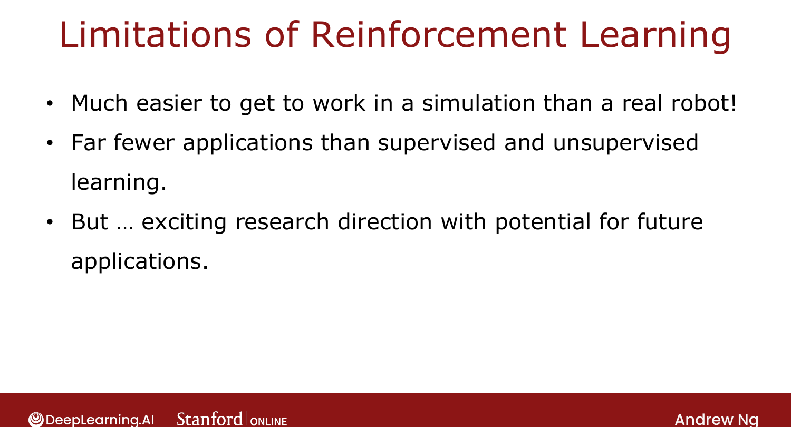

# The State of Reinforcement Learning

> **Course 3 · Week 3** · _AI-generated study aid — not authoritative; trust the lecture & cited sources._

[← Algorithm Refinement: Mini-Batch and Soft Updates](../../course-3/week-3/algorithm-refinement-mini-batch-and-soft-updates.md){ .md-button }

<video controls preload="none" playsinline src="https://dyckms5inbsqq.cloudfront.net/dlai/unsupervised-learning-recommenders-reinforcement-learning/W3/L16-MLS-C3W3L3S07-the-state-of-reinf/lc-unsupervised-learning-recommenders-reinforcement-learning-W3-L16-MLS-C3W3L3S07-the-state-of-reinf-master_360p.mp4?v=1752487443">Your browser can't play this video — <a href="https://dyckms5inbsqq.cloudfront.net/dlai/unsupervised-learning-recommenders-reinforcement-learning/W3/L16-MLS-C3W3L3S07-the-state-of-reinf/lc-unsupervised-learning-recommenders-reinforcement-learning-W3-L16-MLS-C3W3L3S07-the-state-of-reinf-master_360p.mp4?v=1752487443">download the lecture</a>.</video>

> 📄 **[Read the full lecture transcript](the-state-of-reinforcement-learning-transcript.md)**

A candid, practical close: RL is exciting (it was Ng's own PhD thesis topic) but **over-hyped**.
Here's where it actually stands. `[00:02]`

## Two reality checks

1. **Simulation ≫ real world.** Most RL research runs in **simulations / video games**, which
   are *far* easier than real robots. Many developers find an algorithm that works in
   simulation is **surprisingly hard** to transfer to real hardware — watch for this gap. `[00:36]`
2. **Far fewer applications than supervised/unsupervised learning.** Despite the media
   coverage, for a practical project the odds that **supervised or unsupervised** learning is
   the right tool are much higher than RL. Ng himself uses RL occasionally (robotic control)
   but reaches for supervised/unsupervised far more in day-to-day work. `[01:24]`

{ .slide }
_Official C3 slide — the state of reinforcement learning (DeepLearning.AI / Stanford)._
{ .slide-cap }

## But still a pillar

There's a lot of exciting RL research, its future potential is large, and it remains one of
the **major pillars of machine learning** — worth having in your framework even if you reach
for it less often. `[02:00]`

That closes the week — and the technical content of the specialization. Enjoy landing the
lunar lander with code you wrote yourself. `[02:27]`

[← Algorithm Refinement: Mini-Batch and Soft Updates](../../course-3/week-3/algorithm-refinement-mini-batch-and-soft-updates.md){ .md-button }

