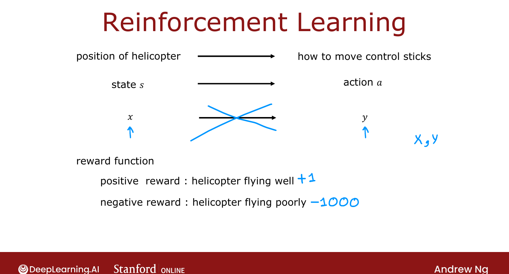
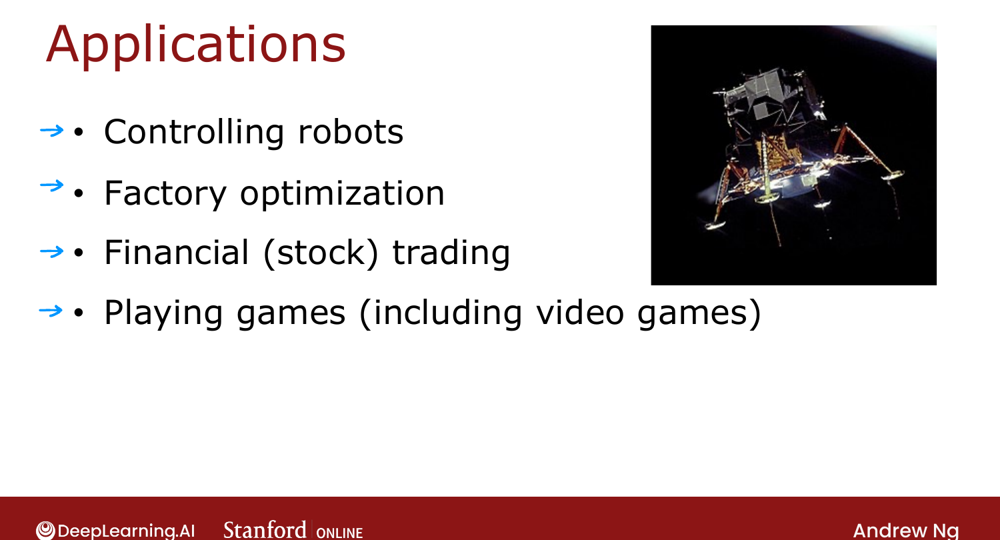

# What is Reinforcement Learning?

> **Course 3 · Week 3** · _AI-generated study aid — not authoritative; trust the lecture & cited sources._

[← PCA in Code](../../course-3/week-2/pca-in-code.md){ .md-button }

[Mars Rover Example →](../../course-3/week-3/mars-rover-example.md){ .md-button }

<video controls preload="none" playsinline src="https://dyckms5inbsqq.cloudfront.net/dlai/unsupervised-learning-recommenders-reinforcement-learning/W3/L1-MLS-C3W3L1S01-what-is-reinforcem/lc-unsupervised-learning-recommenders-reinforcement-learning-W3-L1-MLS-C3W3L1S01-what-is-reinforcem-master_360p.mp4?v=1752487439">Your browser can't play this video — <a href="https://dyckms5inbsqq.cloudfront.net/dlai/unsupervised-learning-recommenders-reinforcement-learning/W3/L1-MLS-C3W3L1S01-what-is-reinforcem/lc-unsupervised-learning-recommenders-reinforcement-learning-W3-L1-MLS-C3W3L1S01-what-is-reinforcem-master_360p.mp4?v=1752487439">download the lecture</a>.</video>

> 📄 **[Read the full lecture transcript](what-is-reinforcement-learning-transcript.md)**

This final week covers **reinforcement learning (RL)** — not yet as commercially common as
supervised learning, but a pillar of ML with active research. The core idea: tell the
algorithm **what** to do (via rewards), not **how**. `[00:02]`

## The autonomous-helicopter problem

Given a helicopter's **state** $s$ (position, orientation, speed) ten times a second, decide
the **action** $a$ (how to move the control sticks) to keep it balanced. RL trained Stanford's
helicopter to fly aerobatics — even **upside down**. `[00:38]`

Why not supervised learning? You'd need a dataset of states $x$ with the ideal action $y$ —
but mid-flight the single "right" action is genuinely **ambiguous** (tilt a little left or a
lot?), so collecting $(x, y)$ pairs doesn't work well for control. RL sidesteps this. `[03:05]`

## The reward function — "good dog, bad dog"

The key input is a **reward function** that says when the agent is doing well or poorly —
like training a puppy: reward good behavior, penalize bad, and let it figure out the rest.
For the helicopter: **+1 per second** flying well, a large **−1000** if it crashes. `[03:53]`

{ .slide }
_Official C3 slide — state, action, and reward (DeepLearning.AI / Stanford)._
{ .slide-cap }

Specifying *what* (the reward) rather than *how* (the action) gives huge flexibility — Ng's
robot dog learned to clamber over obstacles just from a reward for moving left, with no one
programming leg placement. `[06:06]`

## Applications

Robot control, factory optimization, financial/stock trading (e.g. sequencing a large sell
order to avoid moving the price), and game-playing (checkers, chess, Go, video games). This
week's lab: landing a **lunar lander** in simulation. `[07:04]`

!!! note "Source: Sutton & Barto, *Reinforcement Learning: An Introduction* (Ch. 1)"
    The "specify the goal, not the behavior" framing — and the reward hypothesis that *all*
    goals can be cast as maximizing expected cumulative reward — is the foundational idea of
    Sutton & Barto's standard RL text, which this week mirrors.

{ .slide }
_Official C3 slide — RL applications (DeepLearning.AI / Stanford)._
{ .slide-cap }

Next: formalizing RL with a simple **Mars rover** example. `[08:37]`

[← PCA in Code](../../course-3/week-2/pca-in-code.md){ .md-button }

[Mars Rover Example →](../../course-3/week-3/mars-rover-example.md){ .md-button }

